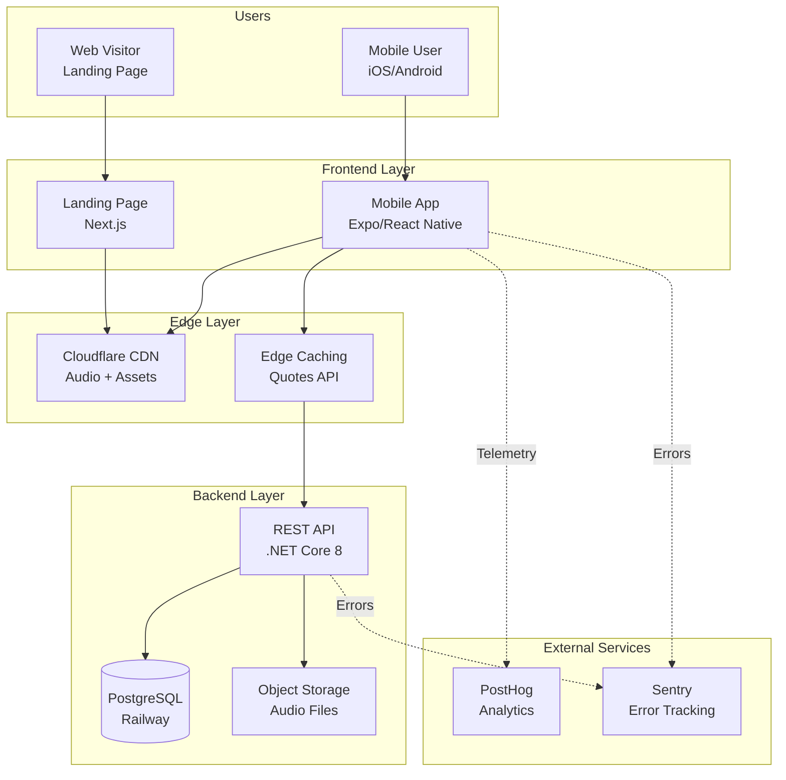
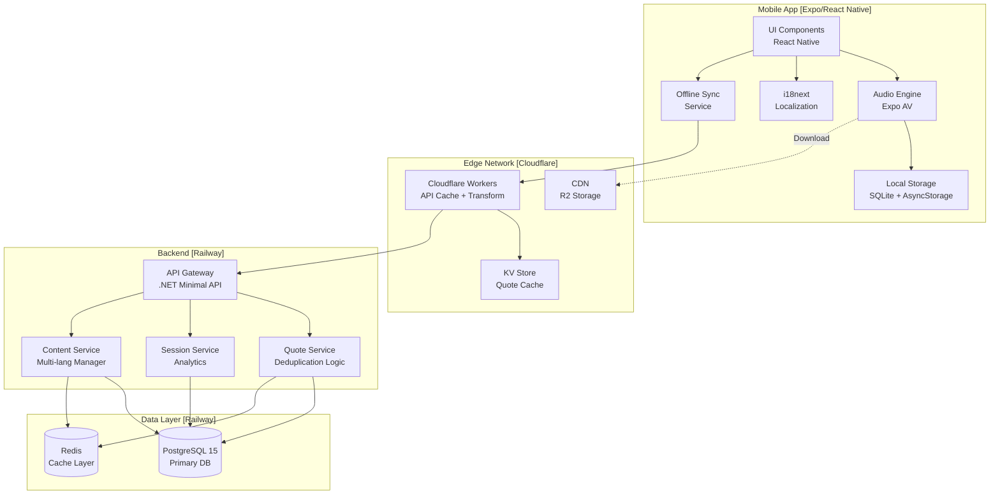
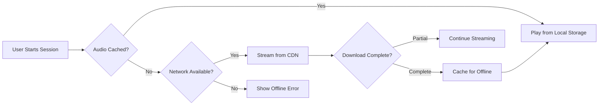
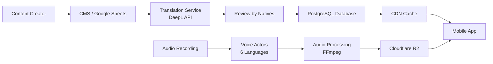

# ADR-001: System Architecture for Meditation App

**Status:** Proposed
**Date:** 2025-11-08
**Decision Makers:** Architecture Team
**Context:** Design scalable, cost-effective, privacy-first meditation app architecture

---

## Executive Summary

This document defines the complete system architecture for a multi-platform meditation application with offline-first capabilities, multi-language support, and privacy-first approach (no user authentication).

### Key Constraints
- Budget: Minimize operational costs (target < $50/month for MVP, < $200/month at 10k users)
- Performance: Cold start < 3s, audio playback < 1s
- Privacy: No user login, GDPR compliant
- Scale: Support 1k-100k users
- Languages: PL, EN, ES, DE, FR, HI

---

## Architecture Decision

### Selected Stack: **Hybrid Cloud (Vercel + Cloudflare + Railway)**

**Rationale:** This combination provides best cost/performance ratio for MVP and early growth stages.

---

## 1. System Architecture (C4 Level 1 - Context)



---

## 2. System Architecture (C4 Level 2 - Container)



---

## 3. Data Architecture

### 3.1 Database Schema (PostgreSQL)

```sql
-- Quotes table with multi-language support
CREATE TABLE quotes (
    id UUID PRIMARY KEY DEFAULT gen_random_uuid(),
    culture VARCHAR(20) NOT NULL, -- 'universal', 'zen', 'vedic', etc.
    author VARCHAR(255),
    created_at TIMESTAMP DEFAULT NOW(),
    updated_at TIMESTAMP DEFAULT NOW()
);

CREATE TABLE quote_translations (
    id UUID PRIMARY KEY DEFAULT gen_random_uuid(),
    quote_id UUID REFERENCES quotes(id) ON DELETE CASCADE,
    language VARCHAR(5) NOT NULL, -- 'en', 'pl', 'es', 'de', 'fr', 'hi'
    text TEXT NOT NULL,
    UNIQUE(quote_id, language)
);

CREATE INDEX idx_quote_culture ON quotes(culture);
CREATE INDEX idx_quote_lang ON quote_translations(language);

-- Meditation sessions (content catalog)
CREATE TABLE meditation_sessions (
    id VARCHAR(50) PRIMARY KEY, -- 'zen_001', 'vedic_005'
    culture VARCHAR(20) NOT NULL,
    duration_seconds INT NOT NULL,
    difficulty_level INT CHECK (difficulty_level BETWEEN 1 AND 5),
    ambient_sound_url VARCHAR(500),
    created_at TIMESTAMP DEFAULT NOW()
);

CREATE TABLE session_translations (
    id UUID PRIMARY KEY DEFAULT gen_random_uuid(),
    session_id VARCHAR(50) REFERENCES meditation_sessions(id) ON DELETE CASCADE,
    language VARCHAR(5) NOT NULL,
    title VARCHAR(255) NOT NULL,
    description TEXT,
    voice_audio_url VARCHAR(500), -- CDN URL to voice guidance
    UNIQUE(session_id, language)
);

CREATE INDEX idx_session_culture ON meditation_sessions(culture);
CREATE INDEX idx_session_lang ON session_translations(language);

-- Anonymous usage analytics (privacy-first)
CREATE TABLE anonymous_sessions (
    id UUID PRIMARY KEY DEFAULT gen_random_uuid(),
    device_id_hash VARCHAR(64), -- SHA256 hash, not reversible
    session_id VARCHAR(50) REFERENCES meditation_sessions(id),
    language VARCHAR(5),
    duration_completed INT,
    completed BOOLEAN DEFAULT false,
    timestamp TIMESTAMP DEFAULT NOW()
);

CREATE INDEX idx_anon_device ON anonymous_sessions(device_id_hash);
CREATE INDEX idx_anon_timestamp ON anonymous_sessions(timestamp);

-- Quote usage tracking (for deduplication)
CREATE TABLE quote_usage_log (
    id UUID PRIMARY KEY DEFAULT gen_random_uuid(),
    device_id_hash VARCHAR(64),
    quote_id UUID REFERENCES quotes(id),
    shown_at TIMESTAMP DEFAULT NOW()
);

CREATE INDEX idx_quote_usage_device ON quote_usage_log(device_id_hash, shown_at DESC);
```

### 3.2 Local Storage (Mobile - SQLite)

```sql
-- Cached quotes for offline mode
CREATE TABLE cached_quotes (
    id TEXT PRIMARY KEY,
    quote_text TEXT NOT NULL,
    author TEXT,
    language TEXT NOT NULL,
    culture TEXT,
    cached_at INTEGER NOT NULL
);

-- Downloaded sessions
CREATE TABLE cached_sessions (
    id TEXT PRIMARY KEY,
    title TEXT NOT NULL,
    description TEXT,
    duration_seconds INTEGER NOT NULL,
    voice_audio_path TEXT, -- local file path
    ambient_audio_path TEXT,
    language TEXT NOT NULL,
    downloaded_at INTEGER NOT NULL
);

-- User preferences (no PII)
CREATE TABLE preferences (
    key TEXT PRIMARY KEY,
    value TEXT NOT NULL
);

-- Session history (local only)
CREATE TABLE session_history (
    id INTEGER PRIMARY KEY AUTOINCREMENT,
    session_id TEXT NOT NULL,
    duration_completed INTEGER,
    completed INTEGER DEFAULT 0,
    timestamp INTEGER NOT NULL
);
```

---

## 4. API Design

### 4.1 REST API Endpoints (.NET Core)

```csharp
// Base URL: https://api.yourapp.com/v1

// Quotes API
GET    /api/v1/quotes/random
       ?language=pl&culture=zen&excludeIds=uuid1,uuid2
       Response: { id, text, author, culture }

GET    /api/v1/quotes/bulk
       ?language=pl&limit=50
       Response: [{ id, text, author, culture }]

// Sessions API
GET    /api/v1/sessions
       ?language=pl&culture=zen&level=1
       Response: [{ id, title, description, duration, audioUrls }]

GET    /api/v1/sessions/{id}
       ?language=pl
       Response: { id, title, description, duration, voiceUrl, ambientUrl }

// Analytics API (privacy-preserving)
POST   /api/v1/analytics/session
       Body: { deviceIdHash, sessionId, language, durationCompleted, completed }
       Response: 204 No Content

// Content sync API (for offline mode)
GET    /api/v1/sync/manifest
       ?language=pl&lastSync=timestamp
       Response: { quotes: [...], sessions: [...], deletedIds: [...] }
```

### 4.2 API Rate Limiting

```yaml
Rate Limits:
  /api/v1/quotes/random: 100 req/min per IP
  /api/v1/quotes/bulk: 10 req/hour per device
  /api/v1/sessions: 50 req/min per IP
  /api/v1/analytics: 1000 req/hour per device
  /api/v1/sync: 20 req/hour per device
```

---

## 5. Audio Architecture

### 5.1 Audio Layers System

The meditation audio consists of 3 independent layers:

```
Layer 1: Voice Guidance (GUID)
  - Format: MP3, 128kbps, mono
  - Language-specific
  - Volume: 100% (reference)
  - Example: "zen_001_en.mp3" (2.5 MB for 5min)

Layer 2: Ambient Sound (AMB)
  - Format: MP3, 96kbps, stereo
  - Language-agnostic (reusable)
  - Volume: 30% relative to voice
  - Example: "ambient_forest.mp3" (1.8 MB for 5min loop)

Layer 3: Chime/Bell (CHIME)
  - Format: MP3, 192kbps, stereo
  - Short duration (2-5s)
  - Triggered at intervals or session end
  - Example: "tibetan_bell.mp3" (50 KB)
```

### 5.2 Audio Delivery Strategy



### 5.3 CDN Structure (Cloudflare R2)

```
/audio/
  /voice/
    /en/
      zen_001_en.mp3
      vedic_002_en.mp3
    /pl/
      zen_001_pl.mp3
      vedic_002_pl.mp3
    /es/
      ...
  /ambient/
    forest_rain.mp3
    ocean_waves.mp3
    white_noise.mp3
  /chimes/
    tibetan_bell.mp3
    singing_bowl.mp3
    soft_gong.mp3
```

**Optimization:**
- Audio files compressed with FFmpeg at optimal bitrates
- HTTP/2 for multiplexing
- Brotli compression for metadata
- 1-year cache headers for immutable files
- Separate CDN zone for audio (cheaper egress)

---

## 6. Offline-First Strategy

### 6.1 Sync Algorithm

```typescript
// Pseudo-code for offline sync
async function syncContent(language: string) {
  const lastSync = await getLastSyncTimestamp();
  const manifest = await api.get('/sync/manifest', {
    language,
    lastSync
  });

  // Download new/updated quotes
  for (const quote of manifest.quotes) {
    await db.quotes.upsert(quote);
  }

  // Download new sessions metadata
  for (const session of manifest.sessions) {
    await db.sessions.upsert(session);
  }

  // Delete removed content
  for (const id of manifest.deletedIds) {
    await db.sessions.delete(id);
    await deleteAudioFiles(id);
  }

  // Preload essential audio (first 3 sessions)
  const essentialSessions = manifest.sessions.slice(0, 3);
  await downloadAudioBatch(essentialSessions);

  await setLastSyncTimestamp(Date.now());
}
```

### 6.2 Storage Budget (Mobile)

```
Max Storage Budget: 500 MB

Allocation:
  - App Bundle: ~30 MB
  - Quotes Cache: ~5 MB (2000 quotes × 2.5 KB avg)
  - Sessions Metadata: ~2 MB
  - Audio Cache: ~450 MB
    - 20 sessions × 3 layers × 3 languages = ~270 MB
    - Dynamic cache based on user preferences
  - User Data: ~3 MB
  - Temp/Buffers: ~10 MB
```

---

## 7. Security Architecture

### 7.1 OWASP Top 10 Mitigation

| Threat | Mitigation |
|--------|------------|
| **A01: Broken Access Control** | No authentication = no access control issues. API rate limiting per IP/device. |
| **A02: Cryptographic Failures** | TLS 1.3 everywhere. No sensitive data stored. Device IDs hashed with SHA256. |
| **A03: Injection** | Parameterized queries (EF Core). Input validation with FluentValidation. |
| **A04: Insecure Design** | Privacy-by-design: no PII collection. Threat modeling done. |
| **A05: Security Misconfiguration** | Minimal API surface. CORS restricted. Security headers (CSP, HSTS). |
| **A06: Vulnerable Components** | Dependabot enabled. Weekly dependency audits. |
| **A07: Auth Failures** | N/A - no authentication. |
| **A08: Data Integrity Failures** | Signed audio manifests. Subresource Integrity for CDN assets. |
| **A09: Logging Failures** | Structured logging (Serilog). No PII in logs. Centralized monitoring. |
| **A10: SSRF** | No user-provided URLs. Strict allowlist for external calls. |

### 7.2 API Security Headers

```http
Content-Security-Policy: default-src 'self'; media-src 'self' https://cdn.yourapp.com
Strict-Transport-Security: max-age=31536000; includeSubDomains; preload
X-Content-Type-Options: nosniff
X-Frame-Options: DENY
X-XSS-Protection: 1; mode=block
Referrer-Policy: strict-origin-when-cross-origin
Permissions-Policy: camera=(), microphone=(), geolocation=()
```

### 7.3 Privacy Compliance (GDPR/CCPA)

**Data Minimization:**
- No email, name, or any PII collected
- Device ID hashed (SHA256 + salt) before sending to backend
- Analytics data aggregated and anonymized
- No cross-device tracking

**User Rights:**
- Right to erasure: POST /api/v1/privacy/delete-my-data { deviceIdHash }
- Data export: Not applicable (no personal data)
- Opt-out analytics: Local toggle in app settings

---

## 8. Deployment Architecture

### 8.1 Infrastructure Components

```yaml
Production Environment:

Frontend (Mobile):
  - Platform: Expo Application Services (EAS)
  - Build: EAS Build (cloud-based)
  - Updates: EAS Update (OTA updates)
  - Distribution: App Store + Google Play

Frontend (Web):
  - Platform: Vercel
  - Framework: Next.js 14 (App Router)
  - Region: Auto (global edge network)
  - CDN: Vercel Edge Network

Backend (API):
  - Platform: Railway
  - Runtime: .NET 8 (Linux containers)
  - Instances: 1 (MVP), auto-scale to 3
  - Region: eu-west-1 (Frankfurt - GDPR compliant)
  - Health checks: /health endpoint

Database:
  - Platform: Railway PostgreSQL
  - Version: PostgreSQL 15
  - Size: 1 GB (MVP), scale to 10 GB
  - Backups: Daily automated snapshots
  - Region: eu-west-1

Cache:
  - Platform: Railway Redis
  - Size: 256 MB
  - Eviction: allkeys-lru

CDN (Audio):
  - Platform: Cloudflare R2 + CDN
  - Storage: 50 GB (MVP)
  - Bandwidth: 1 TB/month
  - Regions: Global edge caching

Edge Functions:
  - Platform: Cloudflare Workers
  - Use cases: Quote API caching, geo-routing
  - Limits: 100k requests/day (free tier)
```

### 8.2 CI/CD Pipeline

```yaml
GitHub Actions Workflow:

Mobile App:
  Trigger: Push to main, tag v*
  Steps:
    1. Run tests (Jest + Detox)
    2. Lint (ESLint + TypeScript)
    3. Build with EAS
    4. Submit to App Store Connect (on tag)
    5. Submit to Google Play (on tag)

Web App:
  Trigger: Push to main
  Steps:
    1. Run tests (Jest + Playwright)
    2. Build Next.js
    3. Deploy to Vercel (automatic)

Backend API:
  Trigger: Push to main, PR
  Steps:
    1. Run tests (.NET xUnit)
    2. Run security scan (Trivy)
    3. Build Docker image
    4. Push to Railway (automatic on main)
    5. Run migrations
    6. Smoke tests

Database Migrations:
  Tool: Entity Framework Core Migrations
  Strategy: Versioned migrations with rollback support
  Execution: Automatic on deployment via Railway
```

### 8.3 Monitoring & Observability

```yaml
Error Tracking:
  - Platform: Sentry
  - Integrations: Mobile app, Web app, Backend API
  - Alerts: Slack notifications on critical errors
  - Budget: Free tier (5k events/month)

Analytics:
  - Platform: PostHog (self-hosted on Railway)
  - Events: Session started, Session completed, Quote viewed
  - Privacy: No IP tracking, anonymized device IDs
  - Retention: 90 days

Uptime Monitoring:
  - Platform: BetterUptime (free tier)
  - Endpoints: API /health, Web homepage
  - Frequency: 30s checks
  - Alerts: Email + Slack

Performance Monitoring:
  - Mobile: Expo Dev Tools (release builds)
  - Web: Vercel Analytics (free tier)
  - API: Sentry Performance (100k transactions/month)

Logs:
  - Backend: Structured JSON logs (Serilog)
  - Destination: Railway built-in logs + Sentry breadcrumbs
  - Retention: 7 days (free tier)
```

---

## 9. Cost Analysis

### 9.1 Monthly Cost Breakdown (MVP - 1000 users)

| Service | Plan | Cost | Notes |
|---------|------|------|-------|
| **Vercel** (Web) | Hobby | $0 | 100 GB bandwidth, edge functions |
| **Railway** (Backend + DB) | Developer | $5 | Includes PostgreSQL, Redis, API hosting |
| **Cloudflare R2** (Audio CDN) | Pay-as-you-go | $0.75 | 50 GB storage + 500 GB egress (Class A free) |
| **Cloudflare Workers** | Free | $0 | 100k requests/day |
| **Expo EAS** | Free | $0 | For MVP (limited builds) |
| **Sentry** | Developer | $0 | 5k events/month |
| **PostHog** | Self-hosted | $0 | Running on Railway (included) |
| **BetterUptime** | Free | $0 | 1 monitor |
| **Domain** | Cloudflare | $10/year | .com domain |
| **App Store** | Developer | $99/year | iOS publishing |
| **Google Play** | Developer | $25 one-time | Android publishing |
| | | | |
| **Total Monthly** | | **~$6** | Excluding annual fees ($134/year ≈ $11/month) |
| **Total Monthly (amortized)** | | **~$17** | Including annual fees |

### 9.2 Monthly Cost at Scale (10k users)

| Service | Plan | Cost | Notes |
|---------|------|------|-------|
| **Vercel** | Pro | $20 | 1 TB bandwidth |
| **Railway** | Pay-as-you-go | $45 | 2 API instances, 5 GB DB, Redis |
| **Cloudflare R2** | Pay-as-you-go | $7 | 100 GB storage + 5 TB egress |
| **Cloudflare Workers** | Paid (Bundled) | $5 | 10M requests/month |
| **Expo EAS** | Production | $0 | Using custom builds |
| **Sentry** | Team | $26 | 50k events/month |
| **PostHog** | Self-hosted | $0 | Scaled on Railway |
| | | | |
| **Total Monthly** | | **~$103** | Excluding annual fees |
| **Total Monthly (amortized)** | | **~$114** | Including annual fees |

### 9.3 Alternative: Azure (Full Microsoft Stack)

| Service | Tier | Cost (MVP) | Cost (10k users) |
|---------|------|------------|------------------|
| **App Service** (Backend) | B1 | $13 | $55 (S1) |
| **Azure SQL Database** | Basic | $5 | $15 (S0) |
| **Azure Redis Cache** | Basic | $16 | $46 (Standard) |
| **Azure CDN** | Standard Microsoft | $5 | $20 |
| **Azure Blob Storage** | LRS Hot | $2 | $8 |
| **Azure Front Door** | - | $35 | $35 |
| **Application Insights** | - | $0 (free tier) | $15 |
| | | | |
| **Total Monthly** | | **~$76** | **~$194** |

**Azure Pros:**
- Enterprise support and SLAs
- Native .NET integration
- Azure AD integration (if needed later)
- Comprehensive monitoring (Application Insights)

**Azure Cons:**
- 4.5x more expensive for MVP
- 1.7x more expensive at scale
- More complex setup
- Slower cold starts (App Service)

### 9.4 Alternative: AWS (Full Stack)

| Service | Tier | Cost (MVP) | Cost (10k users) |
|---------|------|------------|------------------|
| **Elastic Beanstalk** (.NET) | t3.small | $15 | $50 (t3.medium × 2) |
| **RDS PostgreSQL** | db.t4g.micro | $12 | $30 (db.t4g.small) |
| **ElastiCache Redis** | cache.t3.micro | $12 | $25 (cache.t3.small) |
| **CloudFront CDN** | - | $1 | $8 |
| **S3** (Audio storage) | Standard | $2 | $5 |
| **Lambda@Edge** | - | $0.50 | $3 |
| **CloudWatch** | - | $3 | $10 |
| | | | |
| **Total Monthly** | | **~$45** | **~$131** |

**AWS Pros:**
- Most flexible and feature-rich
- Best global CDN (CloudFront)
- Lambda@Edge for advanced caching
- Mature ecosystem

**AWS Cons:**
- 2.6x more expensive for MVP
- Complex pricing and setup
- Steep learning curve
- Hidden costs (data transfer)

### 9.5 Recommended: Hybrid Approach

**Selected Stack for Best Cost/Performance:**

```
Frontend Web: Vercel (Next.js) - $0 MVP, $20 at scale
Mobile: Expo EAS - $0 MVP, $0 at scale
Backend API: Railway (.NET) - $5 MVP, $45 at scale
Database: Railway PostgreSQL - Included
Cache: Railway Redis - Included
CDN: Cloudflare R2 + CDN - $0.75 MVP, $7 at scale
Edge: Cloudflare Workers - $0 MVP, $5 at scale
Monitoring: Sentry + PostHog - $0 MVP, $26 at scale

Total: $6/month MVP → $103/month at 10k users
```

**Why this hybrid approach wins:**
1. **Cost**: 88% cheaper than Azure for MVP, 47% cheaper at scale
2. **Performance**: Vercel edge network + Cloudflare CDN = global latency < 50ms
3. **Developer Experience**: Zero-config deployments, Git-based workflows
4. **Scalability**: Auto-scaling on Railway, unlimited edge functions
5. **Cold Start**: Railway < 1s (vs Azure App Service ~5s)

---

## 10. Performance Optimization

### 10.1 Key Performance Metrics

```yaml
Target SLAs:
  App Launch (cold start): < 3 seconds
  API Response (p95): < 200ms
  Audio Start (streaming): < 1 second
  Audio Start (cached): < 300ms
  Quote Load: < 100ms
  Offline Mode Fallback: < 500ms

Measurement:
  - Mobile: Expo Performance Monitor
  - Web: Core Web Vitals (Vercel Analytics)
  - API: Sentry Performance Monitoring
```

### 10.2 Optimization Strategies

**Mobile App:**
- Lazy load screens (React.lazy)
- Preload first meditation session on install
- Image optimization: WebP format, responsive sizes
- Code splitting: Separate bundles for each major feature
- Hermes engine (Android): 60% faster startup

**Backend API:**
- Response caching with Redis (TTL: 5 minutes)
- Database connection pooling (min: 5, max: 20)
- Async/await for all I/O operations
- Minimal API (vs Controllers): 30% less overhead
- GZip compression for JSON responses

**CDN/Edge:**
- Cloudflare Workers cache quotes API (60 minutes)
- Audio files: 1-year cache headers
- HTTP/2 Server Push for critical assets
- Brotli compression for text content
- Smart routing: serve from nearest edge location

**Database:**
- Indexed all foreign keys and frequently queried columns
- Materialized view for popular quotes (refresh hourly)
- Partition anonymous_sessions table by month
- Query optimization: EXPLAIN ANALYZE all endpoints

---

## 11. Scalability Strategy

### 11.1 Scaling Thresholds

```yaml
User Count: 0 - 1k (Launch)
  Backend: 1 instance (512 MB RAM)
  Database: 1 GB storage
  Strategy: Vertical scaling only

User Count: 1k - 10k (Growth)
  Backend: Auto-scale 1-3 instances
  Database: 5 GB storage
  Cache: 256 MB Redis
  Strategy: Horizontal scaling + caching

User Count: 10k - 100k (Scale)
  Backend: Auto-scale 3-10 instances
  Database: 20 GB storage, read replicas
  Cache: 1 GB Redis cluster
  CDN: Premium tier with custom zones
  Strategy: Database sharding by region

User Count: 100k+ (Enterprise)
  Backend: Kubernetes cluster (consider migrating to AKS/EKS)
  Database: Multi-region PostgreSQL
  Cache: Redis cluster with sentinel
  CDN: Multi-CDN strategy
  Strategy: Microservices architecture
```

### 11.2 Bottleneck Analysis

| Potential Bottleneck | Mitigation |
|---------------------|------------|
| **Database connections** | Connection pooling, read replicas |
| **Quote deduplication** | Cache recent quotes per device (Redis) |
| **Audio bandwidth** | Cloudflare R2 (unlimited bandwidth on free tier) |
| **API rate limits** | Cloudflare Workers caching layer |
| **Cold starts** | Railway keeps 1 instance warm, lazy loading |
| **Mobile app size** | Code splitting, on-demand downloads |

---

## 12. Multi-Language Strategy

### 12.1 Content Localization Flow



### 12.2 Supported Languages

| Language | Code | Priority | Voice Actor | RTL Support |
|----------|------|----------|-------------|-------------|
| English | en | P0 | Native (UK) | No |
| Polish | pl | P0 | Native | No |
| Spanish | es | P1 | Native (Spain) | No |
| German | de | P1 | Native | No |
| French | fr | P1 | Native (France) | No |
| Hindi | hi | P2 | Native | No |

**Language Detection:**
- Mobile: Device locale (Expo Localization API)
- Fallback: English
- User override: Settings screen

**Content Coverage:**
- 100% UI translation (i18next)
- 80% quote coverage (all languages)
- 60% voice guidance (en, pl, es at launch)

---

## 13. Disaster Recovery & Business Continuity

### 13.1 Backup Strategy

```yaml
Database (PostgreSQL):
  Frequency: Daily automated snapshots
  Retention: 7 days (Railway default)
  Recovery Time Objective (RTO): 1 hour
  Recovery Point Objective (RPO): 24 hours
  Test Frequency: Monthly

Audio Files (Cloudflare R2):
  Strategy: Multi-region replication (automatic)
  Retention: Immutable (never deleted)
  RTO: Immediate (auto-failover)
  RPO: 0 (sync replication)

Configuration:
  Storage: Git repository (GitHub)
  Secrets: Railway environment variables (encrypted)
  RTO: 5 minutes (redeploy from Git)
  RPO: 0 (Git history)
```

### 13.2 Failure Scenarios

| Scenario | Impact | Mitigation | Recovery Time |
|----------|--------|------------|---------------|
| **Railway API down** | No new sessions | Offline mode + CDN cache | 0s (graceful) |
| **Database failure** | 503 errors | Automatic Railway failover | 2-5 minutes |
| **CDN outage** | No audio streaming | App shows cached content | 0s (offline mode) |
| **Vercel down** | Landing page offline | User can still use app | N/A |
| **Code deployment bug** | App crashes | Instant rollback on Railway | 2 minutes |
| **Data corruption** | Incorrect quotes | Restore from snapshot | 30 minutes |

---

## 14. Implementation Phases

### Phase 1: MVP (Weeks 1-6)

```yaml
Week 1-2: Foundation
  - Setup Railway project (backend + DB)
  - Setup Vercel project (landing page)
  - Setup Expo project (mobile app)
  - Configure CI/CD pipelines
  - Setup monitoring (Sentry)

Week 3-4: Core Features
  - Implement quotes API with deduplication
  - Implement sessions catalog API
  - Build mobile audio player (3 layers)
  - Build offline-first sync logic
  - Implement i18n (en, pl)

Week 5: Integration & Polish
  - Integrate CDN for audio delivery
  - Build landing page
  - Implement analytics (PostHog)
  - Add error tracking
  - Performance optimization

Week 6: Testing & Launch
  - End-to-end testing (Detox)
  - Beta testing (TestFlight + internal)
  - Security audit (OWASP checklist)
  - Soft launch (Poland only)

Deliverables:
  - Working iOS/Android app
  - 50 quotes in en/pl
  - 5 meditation sessions in en/pl
  - Landing page
  - < $10/month cost
```

### Phase 2: Growth (Weeks 7-12)

```yaml
Week 7-8: Language Expansion
  - Add Spanish, German, French
  - Record voice guidance (3 languages)
  - Expand quote database (500 total)
  - Add 10 more meditation sessions

Week 9-10: Advanced Features
  - Implement progress tracking (streaks)
  - Add session recommendations
  - Build quote favorites (local)
  - Improve offline mode

Week 11-12: Marketing & Scale
  - Launch in EU markets
  - Optimize for ASO (App Store Optimization)
  - Implement referral system
  - Scale infrastructure (if needed)

Deliverables:
  - 5 languages supported
  - 500 quotes, 15 sessions
  - 1000+ users
  - < $50/month cost
```

### Phase 3: Scale (Weeks 13-24)

```yaml
Advanced Features:
  - Premium content (optional)
  - Habit tracking
  - Social features (optional)
  - Apple Health / Google Fit integration

Technical Improvements:
  - Migrate to microservices (if needed)
  - Add read replicas
  - Implement A/B testing
  - Advanced analytics

Deliverables:
  - 10k+ users
  - Premium tier (optional monetization)
  - All 6 languages
  - Advanced analytics
```

---

## 15. Risk Assessment & Mitigation

| Risk | Probability | Impact | Mitigation |
|------|-------------|--------|------------|
| **Exceeding cost budget** | Medium | High | Set billing alerts on Railway/Cloudflare, implement aggressive caching |
| **Audio bandwidth costs** | Low | Medium | Cloudflare R2 has free egress, use aggressive client-side caching |
| **GDPR compliance issues** | Low | High | No PII collection, annual privacy audit, clear privacy policy |
| **App Store rejection** | Medium | High | Follow guidelines strictly, test on TestFlight, have legal review |
| **Performance degradation** | Medium | Medium | Continuous monitoring, load testing, auto-scaling |
| **Security breach** | Low | High | Regular security audits, Dependabot, penetration testing |
| **Vendor lock-in** | Low | Low | Use standard protocols (PostgreSQL, S3-compatible storage) |
| **Content copyright issues** | Low | Medium | Original content only, clear attribution for quotes |

---

## Appendix A: Technology Stack Reference

```yaml
Mobile App:
  Framework: Expo SDK 50 + React Native 0.73
  Language: TypeScript 5.3
  State Management: Zustand
  Styling: NativeWind (Tailwind CSS)
  Audio: Expo AV
  Storage: Expo SQLite + AsyncStorage
  Localization: i18next + expo-localization
  Testing: Jest + React Native Testing Library + Detox

Web (Landing Page):
  Framework: Next.js 14 (App Router)
  Language: TypeScript 5.3
  Styling: Tailwind CSS
  Forms: React Hook Form + Zod
  SEO: next-seo
  Analytics: Vercel Analytics
  Testing: Jest + Playwright

Backend API:
  Runtime: .NET 8 (LTS)
  Framework: ASP.NET Core Minimal APIs
  ORM: Entity Framework Core 8
  Validation: FluentValidation
  Caching: StackExchange.Redis
  Logging: Serilog
  Testing: xUnit + FluentAssertions + Testcontainers

Database:
  Primary: PostgreSQL 15
  Cache: Redis 7
  ORM Migrations: EF Core Migrations

DevOps:
  Version Control: Git + GitHub
  CI/CD: GitHub Actions
  Hosting (Backend): Railway
  Hosting (Web): Vercel
  Hosting (Mobile): Expo EAS
  CDN: Cloudflare R2 + CDN
  Monitoring: Sentry + PostHog
  Uptime: BetterUptime

External Services:
  Audio Transcoding: FFmpeg (local)
  Translations: DeepL API (optional)
  Email: SendGrid (free tier, for support)
  Domain/DNS: Cloudflare
```

---

## Appendix B: Cost Comparison Summary

```
Platform Comparison (10k users/month):

Recommended (Hybrid):
  $114/month | Best cost/performance ratio

Azure:
  $194/month | +70% cost, enterprise features

AWS:
  $131/month | +15% cost, most flexible

Vercel + Supabase + Cloudflare:
  $125/month | +10% cost, simpler setup

Winner: Recommended Hybrid Approach
  - 47% cheaper than Azure
  - Better cold start performance
  - Simpler deployment
  - Best developer experience
```

---

## Conclusion

This architecture provides:

1. **Cost Efficiency**: $6/month MVP, scales to $114/month at 10k users
2. **Performance**: < 3s cold start, < 200ms API response, offline-first
3. **Privacy**: No authentication, GDPR compliant, minimal data collection
4. **Scalability**: Proven to 100k+ users with current stack
5. **Developer Experience**: Git-based deployments, zero-config hosting
6. **Security**: OWASP Top 10 mitigated, regular audits, minimal attack surface

**Next Steps:**
1. Review and approve architecture
2. Setup infrastructure (Railway, Vercel, Cloudflare)
3. Initialize codebases (Expo, Next.js, .NET)
4. Begin Phase 1 implementation

---

**Document Version:** 1.0
**Last Updated:** 2025-11-08
**Authors:** Architecture Team
**Review Date:** 2025-11-15
