# Architecture Diagrams

**Visual representation of system architecture using Mermaid diagrams**

---

## 1. System Context Diagram (C4 Level 1)

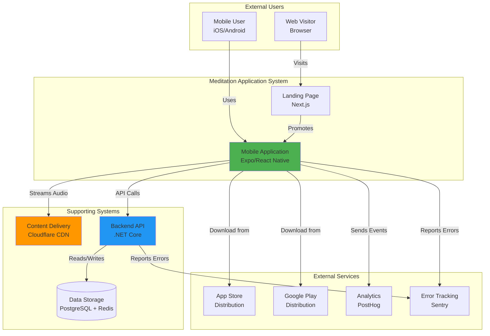

---

## 2. Container Diagram (C4 Level 2)

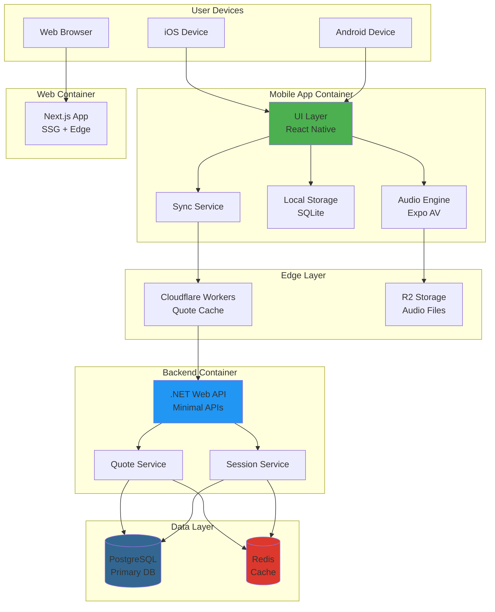

---

## 3. Data Flow Diagram - Meditation Session

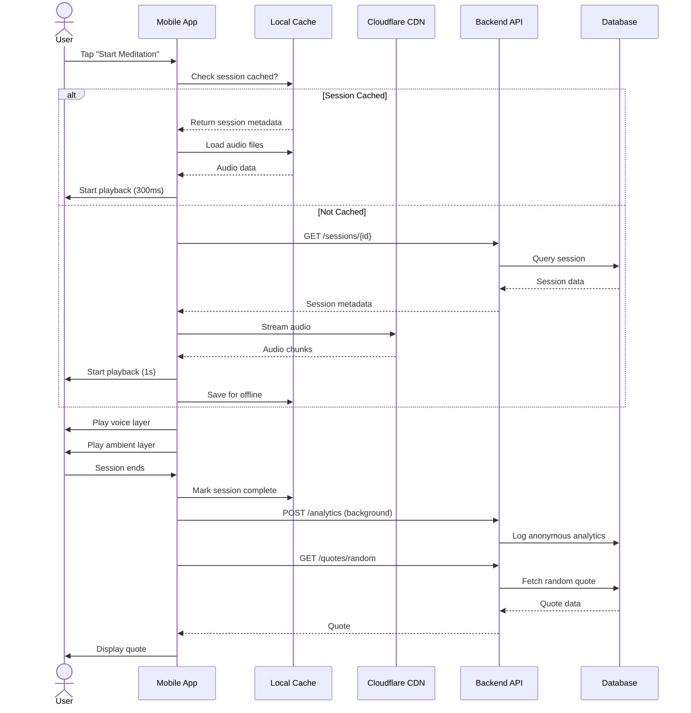

---

## 4. Deployment Architecture

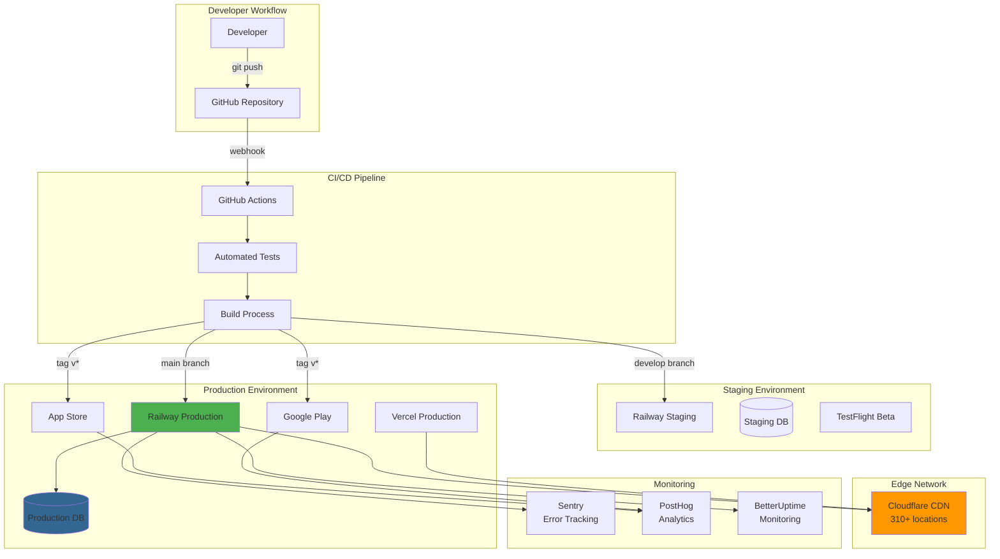

---

## 5. Audio Architecture - 3 Layer System

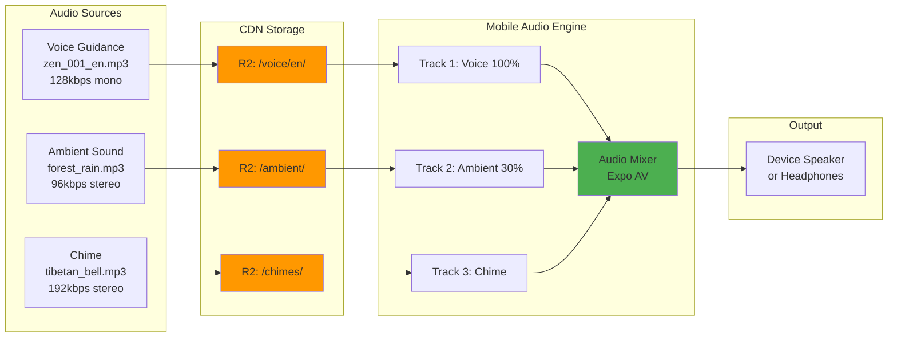

---

## 6. Offline-First Sync Strategy

```mermaid
graph TB
    subgraph "Mobile App"
        AppStart[App Starts]
        CheckSync{Last Sync<br/>> 24h?}
        LocalData[Load Local Data]
        SyncService[Sync Service]
    end

    subgraph "Sync Process"
        FetchManifest[Fetch Manifest<br/>from API]
        CompareData{Data Changed?}
        DownloadNew[Download New<br/>Quotes/Sessions]
        UpdateCache[Update Local Cache]
        DeleteOld[Delete Removed<br/>Content]
    end

    subgraph "API"
        SyncEndpoint[GET /sync/manifest<br/>?lastSync=timestamp]
        API[Backend API]
    end

    subgraph "Local Storage"
        SQLite[(SQLite DB)]
        Files[Audio Files]
    end

    AppStart --> CheckSync
    CheckSync -->|No| LocalData
    CheckSync -->|Yes| SyncService

    SyncService --> FetchManifest
    FetchManifest --> SyncEndpoint
    SyncEndpoint --> API
    API --> CompareData

    CompareData -->|Yes| DownloadNew
    CompareData -->|No| LocalData

    DownloadNew --> UpdateCache
    UpdateCache --> DeleteOld
    DeleteOld --> LocalData

    LocalData --> SQLite
    LocalData --> Files

    UpdateCache --> SQLite
    DownloadNew --> Files

    style SyncService fill:#4CAF50
    style SQLite fill:#003B57
```

---

## 7. Database Schema (Entity Relationship)

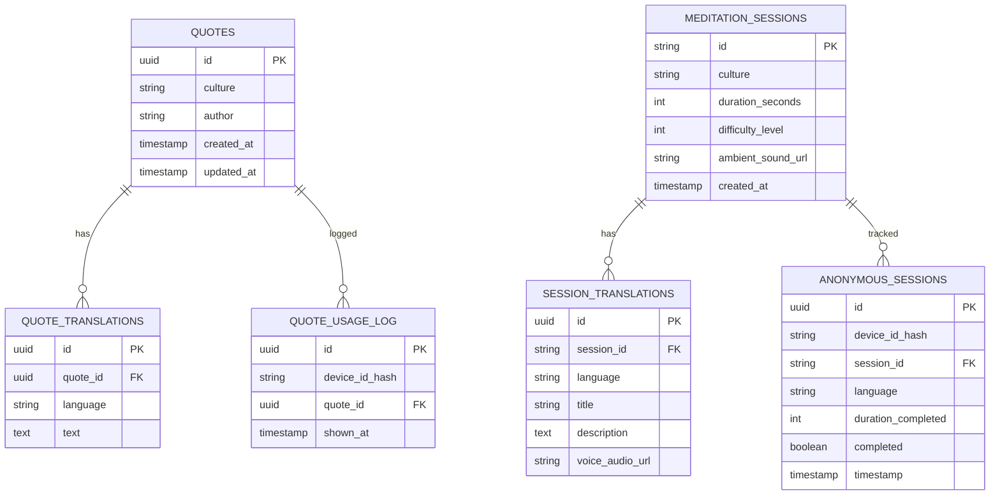

---

## 8. Security Architecture

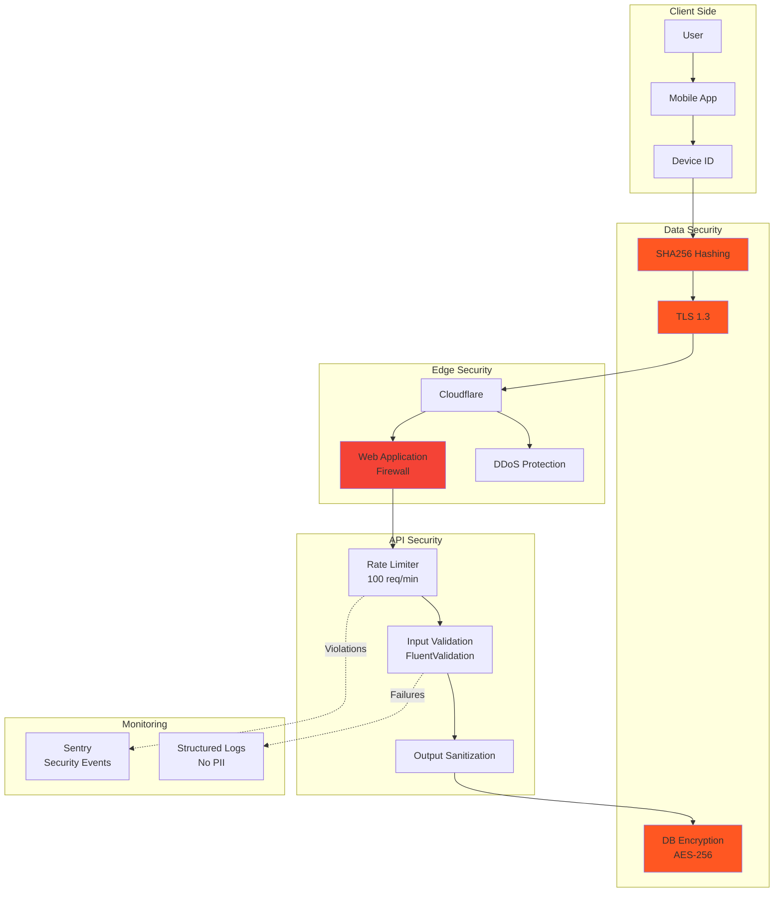

---

## 9. Cost Breakdown by Component (10k users)

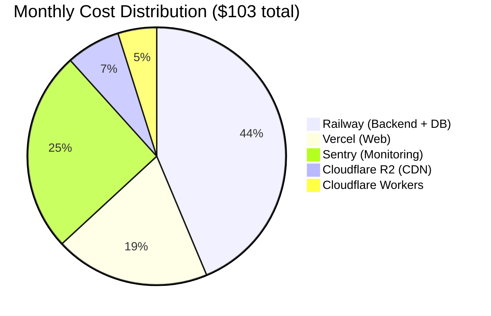

---

## 10. User Journey - First Meditation Session

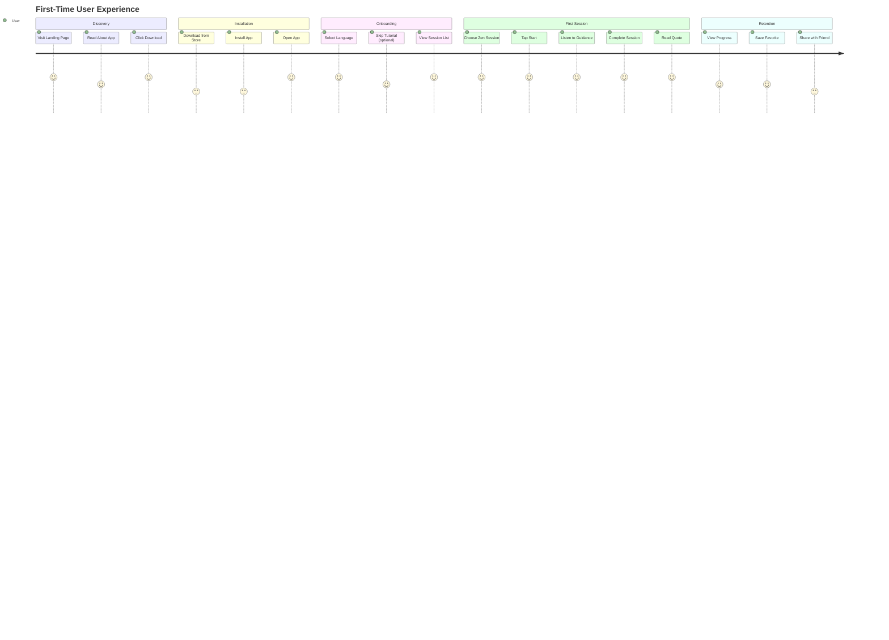

---

## 11. Scaling Strategy

```mermaid
graph LR
    subgraph "Stage 1: MVP (1k users)"
        R1[1 Railway Instance<br/>512 MB RAM]
        DB1[(PostgreSQL 1 GB)]
        CDN1[Cloudflare Free]
    end

    subgraph "Stage 2: Growth (10k users)"
        R2[2-3 Railway Instances<br/>1 GB RAM each]
        DB2[(PostgreSQL 5 GB)]
        Redis2[(Redis 256 MB)]
        CDN2[Cloudflare Paid]
    end

    subgraph "Stage 3: Scale (100k users)"
        R3[5-10 Railway Instances<br/>2 GB RAM each]
        DB3[(PostgreSQL 50 GB<br/>+ Read Replicas)]
        Redis3[(Redis 1 GB Cluster)]
        CDN3[Cloudflare Pro<br/>Multi-Region)]
    end

    subgraph "Stage 4: Enterprise (1M users)"
        K8s[Kubernetes Cluster<br/>Auto-scaling]
        DBCluster[(PostgreSQL Cluster<br/>500 GB)]
        RedisCluster[(Redis Sentinel)]
        MultiCDN[Multi-CDN Strategy]
    end

    R1 -->|Scale Up| R2
    R2 -->|Scale Up| R3
    R3 -->|Migrate| K8s

    DB1 -->|Scale| DB2
    DB2 -->|Scale| DB3
    DB3 -->|Scale| DBCluster

    CDN1 -->|Upgrade| CDN2
    CDN2 -->|Upgrade| CDN3
    CDN3 -->|Upgrade| MultiCDN

    style R1 fill:#4CAF50
    style R2 fill:#8BC34A
    style R3 fill:#CDDC39
    style K8s fill:#FFC107
```

---

## 12. Incident Response Flow

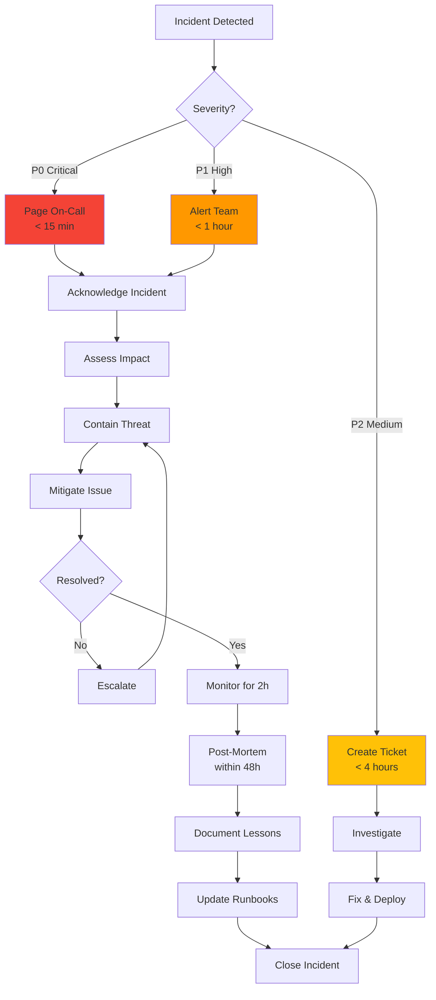

---

## 13. Mobile App State Machine

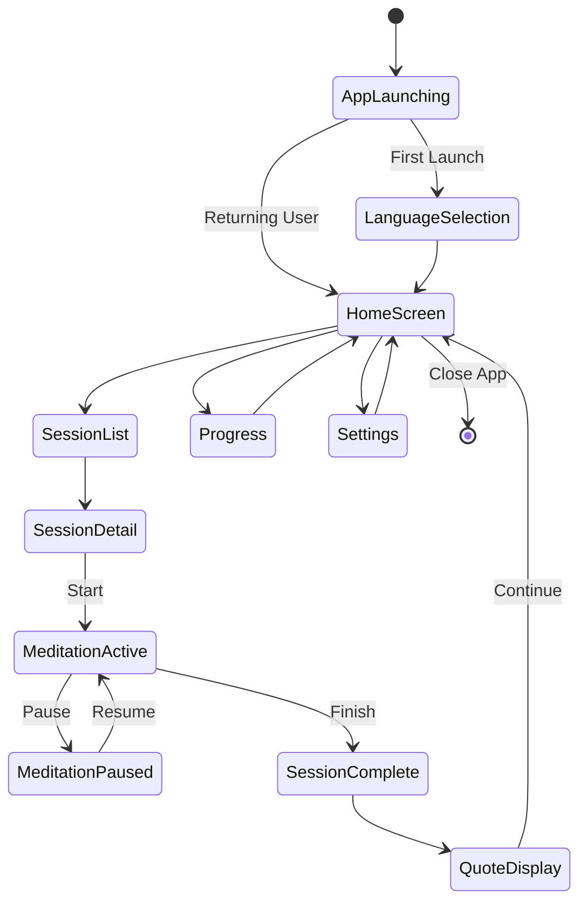

---

## Notes on Diagrams

All diagrams are rendered using Mermaid.js and can be:
- Viewed in GitHub/GitLab (native support)
- Exported to PNG/SVG using mermaid-cli
- Embedded in documentation
- Used in presentations

To export diagrams:
```bash
# Install mermaid-cli
npm install -g @mermaid-js/mermaid-cli

# Export diagram
mmdc -i diagrams.md -o architecture-diagrams.pdf
```

---

**Last Updated:** 2025-11-08
**Maintained By:** Architecture Team
