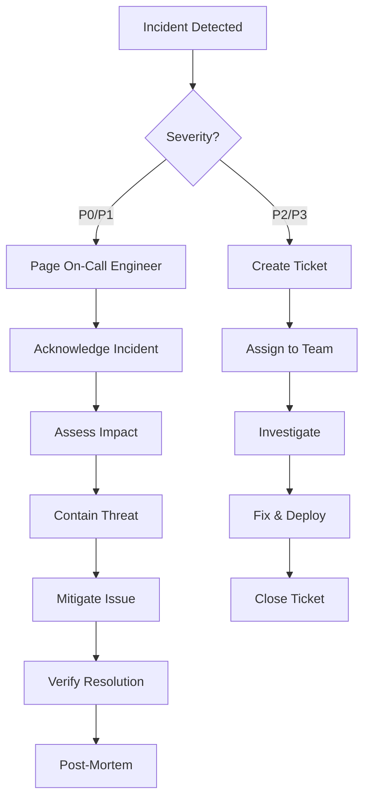

# Security Plan & OWASP Compliance

**Project:** Meditation App (Slow Spot / Airea)
**Version:** 1.0
**Date:** 2025-11-08
**Compliance:** OWASP Top 10 2021, GDPR, Apple App Store, Google Play

---

## 1. Security Overview

### 1.1 Security Posture

```yaml
Threat Model:
  Attack Surface: Minimal (no authentication, no PII)
  Primary Risks: API abuse, data integrity, availability
  Secondary Risks: Content injection, CDN manipulation

Defense Strategy:
  - Privacy by design (no user data)
  - Rate limiting and throttling
  - Input validation and sanitization
  - Regular security audits
  - Automated vulnerability scanning

Compliance Requirements:
  - GDPR (EU users)
  - CCPA (California users)
  - Apple App Store Guidelines
  - Google Play Store Guidelines
  - OWASP Top 10 mitigation
```

---

## 2. OWASP Top 10 (2021) Mitigation

### A01: Broken Access Control

**Risk Level:** LOW (no authentication system)

**Mitigations:**
```yaml
API Design:
  - No user-specific endpoints
  - All content is public
  - Rate limiting prevents abuse
  - IP-based throttling for anonymous analytics

Implementation:
  # .NET Minimal API with rate limiting
  builder.Services.AddRateLimiter(options =>
  {
      options.AddFixedWindowLimiter("api", opt =>
      {
          opt.Window = TimeSpan.FromMinutes(1);
          opt.PermitLimit = 100;
          opt.QueueLimit = 0;
      });
  });

  # Endpoint configuration
  app.MapGet("/api/v1/quotes/random", [RateLimitAttribute("api")] handler);

Testing:
  - Automated rate limit tests
  - Fuzzing for unauthorized access
  - Penetration testing quarterly
```

---

### A02: Cryptographic Failures

**Risk Level:** MEDIUM (device ID hashing, API keys)

**Mitigations:**
```yaml
Data in Transit:
  - TLS 1.3 mandatory (Railway, Vercel, Cloudflare)
  - HSTS headers (max-age: 31536000)
  - Certificate pinning in mobile app (production only)

Data at Rest:
  - Database encryption (Railway default: AES-256)
  - Device IDs hashed before transmission (SHA256 + salt)
  - No sensitive data stored

Secrets Management:
  - Environment variables only
  - Railway/Vercel/Expo secrets encrypted at rest
  - Rotation policy: every 90 days

Implementation:
  # Device ID hashing (mobile app)
  import { SHA256 } from 'crypto-js';

  const SALT = process.env.EXPO_PUBLIC_DEVICE_SALT;
  const deviceId = await getDeviceId();
  const hashedId = SHA256(deviceId + SALT).toString();

  # API key validation (backend)
  const API_KEYS = process.env.ALLOWED_API_KEYS.split(',');

  app.Use(async (context, next) => {
      var apiKey = context.Request.Headers["X-API-Key"];
      if (!API_KEYS.Contains(apiKey))
          context.Response.StatusCode = 401;
      else
          await next();
  });

Certificate Pinning (mobile):
  # expo-ssl-pinning (iOS/Android)
  import { addCertificate } from 'expo-ssl-pinning';

  await addCertificate({
    domain: 'api.yourapp.com',
    fingerprint: 'sha256/AAAAAAA...'
  });
```

---

### A03: Injection

**Risk Level:** MEDIUM (SQL injection, XSS)

**Mitigations:**
```yaml
SQL Injection:
  - Entity Framework Core (parameterized queries)
  - No raw SQL queries
  - Input validation with FluentValidation
  - Stored procedures for complex queries (optional)

Cross-Site Scripting (XSS):
  - React automatic escaping
  - Content Security Policy headers
  - DOMPurify for user-generated content (if added)

Command Injection:
  - No shell commands from user input
  - Restricted file operations
  - Sandboxed environment (Railway containers)

Implementation:
  # Backend: Entity Framework (safe by default)
  var quote = await dbContext.Quotes
      .Where(q => q.Language == language && q.Culture == culture)
      .OrderBy(_ => Guid.NewGuid())
      .FirstOrDefaultAsync();

  # Input validation
  public class GetQuoteRequest
  {
      [Required]
      [StringLength(5, MinimumLength = 2)]
      [RegularExpression("^[a-z]{2,5}$")]
      public string Language { get; set; }

      [StringLength(20)]
      [RegularExpression("^[a-z_]+$")]
      public string? Culture { get; set; }
  }

  # Mobile: React Native (auto-escaping)
  <Text>{quote.text}</Text> // Safe

  # CSP Headers (web)
  Content-Security-Policy:
    default-src 'self';
    script-src 'self' 'unsafe-inline' https://vercel.live;
    media-src 'self' https://cdn.yourapp.com;
    img-src 'self' data: https:;
    connect-src 'self' https://api.yourapp.com;
```

---

### A04: Insecure Design

**Risk Level:** LOW (privacy-first design)

**Mitigations:**
```yaml
Threat Modeling:
  - STRIDE analysis completed (see appendix)
  - Attack trees for critical flows
  - Privacy impact assessment

Secure Design Patterns:
  - Fail securely (default deny)
  - Defense in depth (rate limiting + validation + monitoring)
  - Least privilege (minimal API surface)
  - Separation of duties (dev/staging/prod)

Privacy by Design:
  - No PII collection
  - No authentication required
  - Local-first data storage
  - Anonymized analytics

Implementation:
  # Fail securely example
  public async Task<IResult> GetQuote(string language, string? culture)
  {
      try
      {
          // Validate inputs
          if (!SupportedLanguages.Contains(language))
              return Results.BadRequest("Unsupported language");

          // Fetch quote
          var quote = await _quoteService.GetRandomQuote(language, culture);

          if (quote == null)
              return Results.NotFound(); // Fail closed

          return Results.Ok(quote);
      }
      catch (Exception ex)
      {
          _logger.LogError(ex, "Error fetching quote");
          return Results.StatusCode(500); // Generic error, no details leaked
      }
  }
```

---

### A05: Security Misconfiguration

**Risk Level:** MEDIUM (cloud services, default configs)

**Mitigations:**
```yaml
Backend API:
  - Remove default endpoints (/swagger in production)
  - Disable directory listing
  - Custom error pages (no stack traces)
  - Security headers enforced
  - CORS restricted to known origins

Database:
  - Strong passwords (generated, 32+ chars)
  - SSL/TLS required
  - No public access (Railway internal network)
  - Regular backups enabled

CDN:
  - HTTPS only (HTTP redirects)
  - Signed URLs for sensitive content (if added)
  - Cache-Control headers properly configured

Implementation:
  # Backend: Remove Swagger in production
  if (!app.Environment.IsProduction())
  {
      app.UseSwagger();
      app.UseSwaggerUI();
  }

  # Security headers middleware
  app.Use(async (context, next) =>
  {
      context.Response.Headers.Add("X-Content-Type-Options", "nosniff");
      context.Response.Headers.Add("X-Frame-Options", "DENY");
      context.Response.Headers.Add("X-XSS-Protection", "1; mode=block");
      context.Response.Headers.Add("Referrer-Policy", "strict-origin-when-cross-origin");
      context.Response.Headers.Add("Permissions-Policy",
          "camera=(), microphone=(), geolocation=()");
      await next();
  });

  # CORS configuration
  builder.Services.AddCors(options =>
  {
      options.AddDefaultPolicy(policy =>
      {
          policy.WithOrigins(
              "https://yourapp.com",
              "https://www.yourapp.com"
          )
          .AllowedMethods("GET", "POST")
          .AllowedHeaders("Content-Type", "X-API-Key");
      });
  });

Hardening Checklist:
  - [ ] Default credentials changed
  - [ ] Unused services disabled
  - [ ] Security headers configured
  - [ ] Error messages sanitized
  - [ ] HTTPS enforced everywhere
  - [ ] Dependency versions locked
  - [ ] Logging configured (no secrets)
```

---

### A06: Vulnerable and Outdated Components

**Risk Level:** HIGH (third-party dependencies)

**Mitigations:**
```yaml
Dependency Management:
  - Dependabot enabled (GitHub)
  - Weekly security audits
  - Automated updates for patches
  - Quarterly major version reviews

Tooling:
  - npm audit (Node.js)
  - dotnet list package --vulnerable (.NET)
  - Trivy (container scanning)
  - Snyk (continuous monitoring)

Implementation:
  # GitHub Dependabot config (.github/dependabot.yml)
  version: 2
  updates:
    - package-ecosystem: "npm"
      directory: "/mobile"
      schedule:
        interval: "weekly"
      open-pull-requests-limit: 10

    - package-ecosystem: "nuget"
      directory: "/backend"
      schedule:
        interval: "weekly"

    - package-ecosystem: "github-actions"
      directory: "/"
      schedule:
        interval: "monthly"

  # CI/CD security scan
  - name: Run npm audit
    run: npm audit --audit-level=moderate

  - name: Run .NET vulnerability check
    run: dotnet list package --vulnerable --include-transitive

  # Pre-commit hook
  #!/bin/bash
  npm audit --audit-level=high
  if [ $? -ne 0 ]; then
      echo "Security vulnerabilities detected!"
      exit 1
  fi

Update Policy:
  - Critical/High vulnerabilities: Patch within 24 hours
  - Medium vulnerabilities: Patch within 7 days
  - Low vulnerabilities: Patch in next release
  - Monitor CVE databases weekly
```

---

### A07: Identification and Authentication Failures

**Risk Level:** N/A (no authentication)

**Mitigations:**
```yaml
Current State:
  - No user accounts
  - No passwords
  - No session management
  - No authentication tokens

Future Considerations (if authentication added):
  - OAuth 2.0 / OpenID Connect
  - Passkeys (WebAuthn)
  - Biometric authentication (Touch ID, Face ID)
  - Multi-factor authentication (TOTP)
  - Rate limiting on login attempts

Placeholder Implementation:
  # If premium tier requires auth in future
  - Use Auth0 / Supabase Auth / Firebase Auth
  - Implement PKCE flow for mobile
  - Store tokens securely (Expo SecureStore)
  - Never store passwords (external provider only)
```

---

### A08: Software and Data Integrity Failures

**Risk Level:** MEDIUM (supply chain, CDN)

**Mitigations:**
```yaml
Code Integrity:
  - Signed commits (GPG)
  - Code review required (2 approvers)
  - CI/CD pipeline validation
  - Immutable deployment artifacts

Dependency Integrity:
  - npm lock files committed
  - NuGet package lock files
  - Subresource Integrity (SRI) for CDN assets
  - Verify package signatures

Data Integrity:
  - Database checksums for critical tables
  - Audio file checksums (MD5/SHA256)
  - API response signatures (HMAC)

Implementation:
  # Mobile: Expo Updates code signing
  eas update:configure --auto

  # Web: Subresource Integrity
  <script
    src="https://cdn.yourapp.com/script.js"
    integrity="sha384-oqVuAfXRKap7fdgcCY5uykM6+R9GqQ8K..."
    crossorigin="anonymous">
  </script>

  # Backend: Audio file manifest with checksums
  {
    "sessions": [
      {
        "id": "zen_001",
        "voiceUrl": "https://cdn.yourapp.com/voice/zen_001_en.mp3",
        "checksum": "sha256:abc123...",
        "size": 2560000
      }
    ]
  }

  # Mobile: Verify file integrity before caching
  const downloadedChecksum = await calculateSHA256(filePath);
  if (downloadedChecksum !== manifest.checksum) {
      throw new Error('File integrity check failed');
  }

Supply Chain Security:
  - Pin dependencies to exact versions
  - Review dependency changes in PRs
  - Use official package repositories only
  - Scan container images (Trivy)
```

---

### A09: Security Logging and Monitoring Failures

**Risk Level:** MEDIUM (visibility into attacks)

**Mitigations:**
```yaml
Logging Strategy:
  - Structured logs (JSON format)
  - Centralized logging (Sentry breadcrumbs)
  - No PII in logs
  - Log retention: 30 days

Events to Log:
  - API requests (method, path, status, duration)
  - Authentication events (if added)
  - Rate limit violations
  - Input validation failures
  - Database errors
  - Deployment events
  - Configuration changes

Monitoring:
  - Real-time error tracking (Sentry)
  - Anomaly detection (unusual traffic patterns)
  - Uptime monitoring (BetterUptime)
  - Performance monitoring (Vercel Analytics)

Implementation:
  # Backend: Serilog structured logging
  builder.Host.UseSerilog((context, config) =>
  {
      config
          .ReadFrom.Configuration(context.Configuration)
          .Enrich.WithProperty("Application", "MeditationAPI")
          .Enrich.WithProperty("Environment", context.HostingEnvironment.EnvironmentName)
          .WriteTo.Console(new JsonFormatter())
          .WriteTo.Sentry(o =>
          {
              o.Dsn = context.Configuration["Sentry:Dsn"];
              o.Environment = context.HostingEnvironment.EnvironmentName;
              o.MinimumEventLevel = LogEventLevel.Warning;
          });
  });

  # Log API requests
  app.Use(async (context, next) =>
  {
      var sw = Stopwatch.StartNew();
      await next();
      sw.Stop();

      logger.LogInformation(
          "HTTP {Method} {Path} responded {StatusCode} in {ElapsedMs}ms",
          context.Request.Method,
          context.Request.Path,
          context.Response.StatusCode,
          sw.ElapsedMilliseconds
      );
  });

  # Mobile: Sentry breadcrumbs
  Sentry.addBreadcrumb({
    category: 'audio',
    message: 'Started meditation session',
    level: 'info',
    data: {
      sessionId: 'zen_001',
      language: 'en',
      duration: 300
    }
  });

Alert Rules:
  - Error rate > 5% in 5 minutes → PagerDuty
  - API response time p95 > 1s → Slack
  - Rate limit violations > 100/min → Slack
  - Database CPU > 90% → Slack
  - Failed deployments → Slack
```

---

### A10: Server-Side Request Forgery (SSRF)

**Risk Level:** LOW (no user-provided URLs)

**Mitigations:**
```yaml
Current State:
  - No user-provided URLs accepted
  - All external requests hardcoded or allowlisted
  - No URL redirect functionality
  - No webhook functionality

Preventive Measures:
  - Validate all URLs against strict allowlist
  - Use DNS rebinding protection
  - Disable HTTP redirects for external calls
  - Network segmentation (Railway internal network)

Implementation (if external requests added):
  # Backend: URL validation
  private static readonly string[] AllowedHosts = new[]
  {
      "cdn.yourapp.com",
      "api.deepl.com" // Translation service
  };

  public async Task<HttpResponseMessage> FetchExternal(string url)
  {
      var uri = new Uri(url);

      if (!AllowedHosts.Contains(uri.Host))
          throw new SecurityException("Host not allowed");

      // Prevent DNS rebinding
      var ip = await Dns.GetHostAddressesAsync(uri.Host);
      if (IsPrivateIP(ip[0]))
          throw new SecurityException("Private IP not allowed");

      using var client = new HttpClient();
      client.Timeout = TimeSpan.FromSeconds(5);
      return await client.GetAsync(url);
  }
```

---

## 3. Privacy & Data Protection (GDPR/CCPA)

### 3.1 Data Minimization

```yaml
Data Collected:
  Personal Data: NONE
  Anonymous Data:
    - Device ID (hashed SHA256)
    - Session analytics (duration, completion rate)
    - Language preference
    - App version, OS version
    - Crash reports (sanitized stack traces)

Data NOT Collected:
  - Name, email, phone
  - IP addresses (not logged)
  - Location data
  - Biometric data
  - User-generated content

Storage Locations:
  - Mobile app: Local SQLite (device only)
  - Backend database: Railway EU (Frankfurt)
  - Analytics: PostHog self-hosted (Railway EU)
  - Error tracking: Sentry (EU region)
```

### 3.2 User Rights

```yaml
Right to Access:
  - User can export local data via app settings
  - No server-side data associated with individual

Right to Erasure:
  - User can delete all local data via app settings
  - API endpoint: DELETE /api/v1/privacy/delete-my-data
    (deletes all records with matching device ID hash)

Right to Rectification:
  - Not applicable (no personal data)

Right to Data Portability:
  - Export local data in JSON format

Right to Object:
  - Analytics can be disabled in app settings
  - Crash reporting can be disabled

Implementation:
  # Mobile: Export user data
  const exportData = async () => {
      const preferences = await getPreferences();
      const sessionHistory = await getSessionHistory();
      const cachedQuotes = await getCachedQuotes();

      const data = {
          preferences,
          sessionHistory,
          cachedQuotes,
          exportedAt: new Date().toISOString()
      };

      await Sharing.shareAsync({
          mimeType: 'application/json',
          uri: await FileSystem.writeAsStringAsync(
              FileSystem.documentDirectory + 'my-data.json',
              JSON.stringify(data, null, 2)
          )
      });
  };

  # Backend: Delete user data
  [HttpDelete("privacy/delete-my-data")]
  public async Task<IActionResult> DeleteMyData([FromBody] DeleteDataRequest request)
  {
      var hash = request.DeviceIdHash;

      await _db.AnonymousSessions
          .Where(s => s.DeviceIdHash == hash)
          .ExecuteDeleteAsync();

      await _db.QuoteUsageLog
          .Where(q => q.DeviceIdHash == hash)
          .ExecuteDeleteAsync();

      _logger.LogInformation("Deleted data for device hash {Hash}", hash);

      return NoContent();
  }
```

### 3.3 Privacy Policy

**Key Points:**
```markdown
1. No Account Required
   - You can use the app without creating an account
   - We do not collect your name, email, or any personal information

2. Data We Collect
   - Anonymous usage statistics (session duration, completion rate)
   - Device information (OS version, app version)
   - Crash reports (to improve app stability)

3. How We Use Data
   - Improve app features and performance
   - Understand which meditation sessions are most popular
   - Fix bugs and crashes

4. Data Storage
   - Your meditation history is stored locally on your device
   - We do not sync your data to the cloud
   - You can delete all data anytime in Settings

5. Third-Party Services
   - Sentry (crash reporting) - EU region
   - PostHog (analytics) - self-hosted in EU
   - Cloudflare (content delivery) - global

6. Your Rights
   - Delete your data anytime
   - Opt-out of analytics
   - Export your data

7. Contact
   - Email: privacy@yourapp.com
   - Response time: 48 hours
```

---

## 4. Mobile App Security (iOS/Android)

### 4.1 iOS Security

```yaml
App Transport Security (ATS):
  - Enforced (HTTPS only)
  - No exceptions

Keychain:
  - Expo SecureStore for sensitive data
  - Biometric authentication for premium features (future)

Code Signing:
  - Automatic via Expo EAS
  - Provisioning profiles managed

App Store Guidelines:
  - No adult content
  - No gambling
  - Privacy policy required
  - Data usage disclosure accurate

Implementation:
  # info.plist
  <key>NSAppTransportSecurity</key>
  <dict>
      <key>NSAllowsArbitraryLoads</key>
      <false/>
  </dict>

  # Secure storage (Expo)
  import * as SecureStore from 'expo-secure-store';

  await SecureStore.setItemAsync('device_salt', randomSalt, {
      keychainAccessible: SecureStore.WHEN_UNLOCKED
  });
```

### 4.2 Android Security

```yaml
Network Security Config:
  - HTTPS only (cleartext traffic disabled)
  - Certificate pinning for production

App Signing:
  - Google Play App Signing enabled
  - Upload key secured in Expo

ProGuard/R8:
  - Code obfuscation enabled
  - Shrinking enabled

Permissions:
  - Minimal permissions requested
  - No dangerous permissions (camera, location, contacts)

Implementation:
  # android/app/src/main/res/xml/network_security_config.xml
  <?xml version="1.0" encoding="utf-8"?>
  <network-security-config>
      <base-config cleartextTrafficPermitted="false">
          <trust-anchors>
              <certificates src="system" />
          </trust-anchors>
      </base-config>

      <domain-config cleartextTrafficPermitted="false">
          <domain includeSubdomains="true">api.yourapp.com</domain>
          <pin-set>
              <pin digest="SHA-256">AAAAAAAAAAAAAAAA...</pin>
              <pin digest="SHA-256">BBBBBBBBBBBBBBBB...</pin> <!-- Backup pin -->
          </pin-set>
      </domain-config>
  </network-security-config>

  # app.json (permissions)
  {
    "expo": {
      "android": {
        "permissions": []  // No permissions needed
      }
    }
  }
```

---

## 5. API Security

### 5.1 Rate Limiting

```csharp
// Tiered rate limiting based on endpoint sensitivity

public static class RateLimitPolicies
{
    public const string Public = "public";     // 100 req/min
    public const string Bulk = "bulk";         // 10 req/hour
    public const string Analytics = "analytics"; // 1000 req/hour
}

builder.Services.AddRateLimiter(options =>
{
    // Public endpoints (quotes, sessions)
    options.AddFixedWindowLimiter(RateLimitPolicies.Public, opt =>
    {
        opt.Window = TimeSpan.FromMinutes(1);
        opt.PermitLimit = 100;
        opt.QueueLimit = 0;
    });

    // Bulk download (sync)
    options.AddFixedWindowLimiter(RateLimitPolicies.Bulk, opt =>
    {
        opt.Window = TimeSpan.FromHours(1);
        opt.PermitLimit = 10;
        opt.QueueLimit = 0;
    });

    // Analytics (high volume)
    options.AddSlidingWindowLimiter(RateLimitPolicies.Analytics, opt =>
    {
        opt.Window = TimeSpan.FromHours(1);
        opt.PermitLimit = 1000;
        opt.SegmentsPerWindow = 12; // 5-minute segments
        opt.QueueLimit = 0;
    });

    // Custom rejection response
    options.OnRejected = async (context, token) =>
    {
        context.HttpContext.Response.StatusCode = 429;
        await context.HttpContext.Response.WriteAsJsonAsync(new
        {
            error = "Too many requests",
            retryAfter = context.Lease.TryGetMetadata(
                MetadataName.RetryAfter,
                out var retryAfter
            ) ? retryAfter.TotalSeconds : null
        }, token);
    };
});

// Apply to endpoints
app.MapGet("/api/v1/quotes/random", [RequireRateLimiting(RateLimitPolicies.Public)] handler);
app.MapGet("/api/v1/sync/manifest", [RequireRateLimiting(RateLimitPolicies.Bulk)] handler);
app.MapPost("/api/v1/analytics/session", [RequireRateLimiting(RateLimitPolicies.Analytics)] handler);
```

### 5.2 Input Validation

```csharp
// FluentValidation for all DTOs

public class GetQuoteRequestValidator : AbstractValidator<GetQuoteRequest>
{
    private static readonly string[] SupportedLanguages = { "en", "pl", "es", "de", "fr", "hi" };
    private static readonly string[] SupportedCultures = { "universal", "zen", "vedic", "stoic" };

    public GetQuoteRequestValidator()
    {
        RuleFor(x => x.Language)
            .NotEmpty()
            .Length(2, 5)
            .Must(lang => SupportedLanguages.Contains(lang))
            .WithMessage("Unsupported language");

        RuleFor(x => x.Culture)
            .Length(3, 20)
            .Must(culture => SupportedCultures.Contains(culture))
            .When(x => !string.IsNullOrEmpty(x.Culture))
            .WithMessage("Unsupported culture");

        RuleFor(x => x.ExcludeIds)
            .Must(ids => ids == null || ids.All(id => Guid.TryParse(id, out _)))
            .WithMessage("Invalid quote ID format");
    }
}

// Middleware to validate all requests
app.UseFluentValidationMiddleware();
```

### 5.3 CORS Configuration

```csharp
builder.Services.AddCors(options =>
{
    options.AddDefaultPolicy(policy =>
    {
        if (builder.Environment.IsDevelopment())
        {
            // Allow Expo dev client
            policy.AllowAnyOrigin()
                  .AllowAnyMethod()
                  .AllowAnyHeader();
        }
        else
        {
            policy.WithOrigins(
                "https://yourapp.com",
                "https://www.yourapp.com",
                "exp://yourapp.com" // Expo Go (if needed)
            )
            .WithMethods("GET", "POST", "DELETE")
            .WithHeaders("Content-Type", "X-API-Key", "X-Device-Id")
            .WithExposedHeaders("X-RateLimit-Remaining", "X-RateLimit-Reset")
            .SetPreflightMaxAge(TimeSpan.FromHours(24));
        }
    });
});
```

---

## 6. Incident Response Plan

### 6.1 Incident Classification

```yaml
Severity Levels:
  P0 - Critical:
    - Data breach
    - Service down > 1 hour
    - Security vulnerability actively exploited
    Response: Immediate (< 15 minutes)

  P1 - High:
    - Service degraded
    - High error rate (> 10%)
    - Security vulnerability discovered
    Response: < 1 hour

  P2 - Medium:
    - Minor service issues
    - Performance degradation
    - Non-critical bugs
    Response: < 4 hours

  P3 - Low:
    - Feature requests
    - Minor bugs
    - Documentation issues
    Response: < 24 hours
```

### 6.2 Incident Response Workflow



### 6.3 Security Incident Playbook

```markdown
# Data Breach Response

1. Containment (0-1 hour)
   - [ ] Isolate affected systems
   - [ ] Revoke compromised credentials
   - [ ] Enable extra logging
   - [ ] Notify team via Slack #incidents

2. Assessment (1-4 hours)
   - [ ] Determine scope of breach
   - [ ] Identify affected users (if any)
   - [ ] Review logs for attack vector
   - [ ] Document findings

3. Eradication (4-24 hours)
   - [ ] Patch vulnerability
   - [ ] Reset all API keys
   - [ ] Deploy security updates
   - [ ] Verify no backdoors remain

4. Recovery (24-48 hours)
   - [ ] Restore from clean backups (if needed)
   - [ ] Monitor for reinfection
   - [ ] Gradual service restoration

5. Communication (within 72 hours - GDPR requirement)
   - [ ] Notify affected users (if PII exposed)
   - [ ] Notify data protection authority (if required)
   - [ ] Publish incident report (transparency)

6. Post-Mortem (within 1 week)
   - [ ] Root cause analysis
   - [ ] Update security measures
   - [ ] Improve detection
   - [ ] Train team on lessons learned
```

---

## 7. Security Audit Schedule

```yaml
Daily:
  - Automated dependency scans (Dependabot)
  - Log review for anomalies
  - Uptime monitoring

Weekly:
  - Review Sentry errors
  - Check rate limit violations
  - Dependency updates

Monthly:
  - Manual code review (security focus)
  - Review access controls
  - Update security documentation

Quarterly:
  - Penetration testing (external)
  - OWASP Top 10 compliance check
  - Disaster recovery drill
  - Update threat model

Annually:
  - Full security audit (external firm)
  - Privacy impact assessment
  - Compliance review (GDPR, app stores)
  - Renew SSL certificates (if manual)
```

---

## 8. Security Checklist (Pre-Launch)

```markdown
## Code Security
- [ ] No hardcoded secrets in code
- [ ] No commented-out credentials
- [ ] All dependencies up-to-date
- [ ] No known vulnerabilities (npm audit, dotnet list package)
- [ ] Code obfuscation enabled (Android)
- [ ] Source maps not published (mobile)

## API Security
- [ ] HTTPS enforced everywhere
- [ ] CORS configured correctly
- [ ] Rate limiting enabled
- [ ] Input validation on all endpoints
- [ ] Error messages sanitized (no stack traces)
- [ ] Security headers configured

## Database Security
- [ ] Strong passwords (32+ chars)
- [ ] SSL/TLS required
- [ ] No public access
- [ ] Backups enabled
- [ ] Encryption at rest enabled

## Mobile App Security
- [ ] No sensitive data in logs
- [ ] Certificate pinning enabled (production)
- [ ] Secure storage for tokens
- [ ] Biometric auth for sensitive actions (if applicable)
- [ ] Minimal permissions requested

## Monitoring
- [ ] Sentry configured
- [ ] Logging enabled (no PII)
- [ ] Uptime monitoring active
- [ ] Alerts configured
- [ ] Error rate thresholds set

## Compliance
- [ ] Privacy policy published
- [ ] Terms of service published
- [ ] GDPR compliance verified
- [ ] App Store guidelines followed
- [ ] Google Play guidelines followed

## Incident Response
- [ ] On-call rotation defined
- [ ] Incident playbooks documented
- [ ] Communication channels set up
- [ ] Rollback procedures tested
```

---

## Appendix A: STRIDE Threat Model

```yaml
Spoofing:
  Threat: Attacker impersonates legitimate device
  Mitigation: Device ID hashing, rate limiting
  Residual Risk: LOW

Tampering:
  Threat: Audio files modified in CDN
  Mitigation: File checksums, signed manifests
  Residual Risk: LOW

Repudiation:
  Threat: Cannot trace malicious actions to source
  Mitigation: Structured logging, IP logging (rate limit violations)
  Residual Risk: MEDIUM (acceptable for privacy-first app)

Information Disclosure:
  Threat: User data leaked via API
  Mitigation: No PII collected, no user-specific endpoints
  Residual Risk: VERY LOW

Denial of Service:
  Threat: API overwhelmed with requests
  Mitigation: Rate limiting, auto-scaling, CDN caching
  Residual Risk: MEDIUM (DDoS always possible)

Elevation of Privilege:
  Threat: Attacker gains admin access
  Mitigation: No admin endpoints in API, minimal attack surface
  Residual Risk: VERY LOW
```

---

## Appendix B: Security Tools & Resources

```yaml
Static Analysis:
  - SonarQube (code quality + security)
  - ESLint security plugins
  - Roslyn analyzers (.NET)

Dynamic Analysis:
  - OWASP ZAP (web app scanning)
  - Burp Suite (penetration testing)

Dependency Scanning:
  - Dependabot (GitHub)
  - Snyk (continuous monitoring)
  - Trivy (container scanning)

Monitoring:
  - Sentry (error tracking)
  - PostHog (analytics)
  - BetterUptime (uptime)

Compliance:
  - GDPR.eu (resources)
  - OWASP Top 10 (checklist)
  - CWE Top 25 (common weaknesses)

Training:
  - OWASP Web Security Testing Guide
  - PortSwigger Web Security Academy
  - HackerOne CTF (practice)
```

---

## Conclusion

This security plan ensures:

1. **Defense in Depth**: Multiple layers of security controls
2. **Privacy First**: No PII collection, GDPR compliant
3. **Proactive Monitoring**: Automated scans, real-time alerts
4. **Incident Readiness**: Clear playbooks, tested procedures
5. **Continuous Improvement**: Regular audits, quarterly reviews

**Next Steps:**
1. Implement security headers and rate limiting
2. Configure Sentry and monitoring
3. Setup Dependabot and automated scans
4. Conduct initial penetration test
5. Schedule quarterly security reviews

---

**Document Version:** 1.0
**Last Updated:** 2025-11-08
**Next Review:** 2025-12-08
**Contact:** security@yourapp.com
