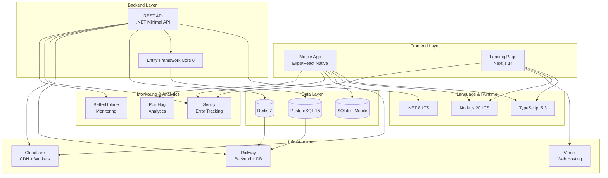

# Technology Stack - Detailed Specification

**Project:** Meditation App (Slow Spot / Airea)
**Version:** 1.0
**Date:** 2025-11-08
**Stack Philosophy:** Modern, scalable, cost-effective, developer-friendly

---

## 1. Technology Stack Overview



---

## 2. Mobile App Stack (Expo/React Native)

### 2.1 Core Framework

```yaml
Runtime:
  Platform: Expo SDK 50
  React Native: 0.73.x
  Engine: Hermes (Android), JavaScriptCore (iOS)
  Language: TypeScript 5.3.3

Build System:
  Tool: Expo Application Services (EAS)
  Build: Cloud-based (eas build)
  Updates: Over-the-air (OTA) via EAS Update
  Distribution: App Store + Google Play
```

### 2.2 Dependencies (package.json)

```json
{
  "name": "meditation-app",
  "version": "1.0.0",
  "main": "expo/AppEntry.js",
  "scripts": {
    "start": "expo start",
    "android": "expo start --android",
    "ios": "expo start --ios",
    "test": "jest",
    "lint": "eslint .",
    "type-check": "tsc --noEmit"
  },
  "dependencies": {
    "expo": "~50.0.0",
    "expo-av": "~14.0.0",
    "expo-file-system": "~16.0.0",
    "expo-sqlite": "~13.0.0",
    "expo-secure-store": "~13.0.0",
    "expo-localization": "~15.0.0",
    "expo-constants": "~15.0.0",
    "expo-updates": "~0.24.0",

    "react": "18.2.0",
    "react-native": "0.73.6",
    "react-native-reanimated": "~3.8.0",
    "react-native-gesture-handler": "~2.15.0",

    "@react-navigation/native": "^6.1.10",
    "@react-navigation/native-stack": "^6.9.18",

    "zustand": "^4.5.0",
    "i18next": "^23.8.0",
    "react-i18next": "^14.0.0",

    "@sentry/react-native": "^5.17.0",
    "posthog-react-native": "^3.0.0",

    "nativewind": "^2.0.11",
    "zod": "^3.22.4",
    "date-fns": "^3.3.0"
  },
  "devDependencies": {
    "@babel/core": "^7.23.9",
    "@types/react": "~18.2.55",
    "@types/react-native": "~0.73.0",
    "typescript": "~5.3.3",

    "@testing-library/react-native": "^12.4.3",
    "jest": "^29.7.0",
    "jest-expo": "~50.0.0",
    "detox": "^20.17.0",

    "eslint": "^8.56.0",
    "eslint-config-expo": "^7.0.0",
    "prettier": "^3.2.4"
  }
}
```

### 2.3 Key Libraries

| Library | Version | Purpose | Why Chosen |
|---------|---------|---------|------------|
| **expo-av** | 14.0.0 | Audio playback (3 layers) | Native audio support, background playback |
| **expo-sqlite** | 13.0.0 | Local database (offline cache) | Fast, reliable, zero-config |
| **zustand** | 4.5.0 | State management | Lightweight (1KB), no boilerplate |
| **i18next** | 23.8.0 | Internationalization | Industry standard, 6 languages |
| **NativeWind** | 2.0.11 | Styling (Tailwind CSS) | Consistent with web, fast development |
| **React Navigation** | 6.1.10 | Navigation | Standard for RN, great DX |
| **Sentry** | 5.17.0 | Error tracking | Best crash reporting, sourcemaps |
| **PostHog** | 3.0.0 | Analytics | Privacy-focused, self-hostable |
| **Detox** | 20.17.0 | E2E testing | Reliable, gray-box testing |

### 2.4 Project Structure

```
mobile/
├── app/                        # Expo Router (file-based routing)
│   ├── (tabs)/                 # Tab navigator
│   │   ├── index.tsx           # Home screen
│   │   ├── meditation.tsx      # Meditation screen
│   │   ├── progress.tsx        # Progress screen
│   │   └── settings.tsx        # Settings screen
│   ├── _layout.tsx             # Root layout
│   └── +not-found.tsx          # 404 screen
│
├── src/
│   ├── components/             # Reusable components
│   │   ├── AudioPlayer.tsx     # 3-layer audio player
│   │   ├── QuoteCard.tsx       # Quote display
│   │   ├── SessionCard.tsx     # Meditation session card
│   │   └── LanguageSelector.tsx
│   │
│   ├── services/               # Business logic
│   │   ├── audio.service.ts    # Audio management
│   │   ├── sync.service.ts     # Offline sync
│   │   ├── quote.service.ts    # Quote fetching
│   │   ├── session.service.ts  # Session management
│   │   └── analytics.service.ts
│   │
│   ├── store/                  # Zustand stores
│   │   ├── useSettingsStore.ts # User preferences
│   │   ├── useSessionStore.ts  # Current session state
│   │   └── useProgressStore.ts # Progress tracking
│   │
│   ├── db/                     # SQLite schema
│   │   ├── schema.ts           # Database schema
│   │   ├── migrations.ts       # Migrations
│   │   └── queries.ts          # SQL queries
│   │
│   ├── i18n/                   # Translations
│   │   ├── en.json
│   │   ├── pl.json
│   │   ├── es.json
│   │   ├── de.json
│   │   ├── fr.json
│   │   └── hi.json
│   │
│   ├── types/                  # TypeScript types
│   │   ├── api.types.ts
│   │   ├── audio.types.ts
│   │   └── session.types.ts
│   │
│   └── utils/                  # Utilities
│       ├── validation.ts       # Input validation (Zod)
│       ├── date.ts             # Date formatting
│       └── logger.ts           # Logging wrapper
│
├── assets/                     # Static assets
│   ├── fonts/
│   ├── images/
│   └── sounds/                 # Bundled chime sounds
│
├── tests/
│   ├── unit/                   # Jest tests
│   └── e2e/                    # Detox tests
│
├── app.json                    # Expo config
├── eas.json                    # EAS Build config
├── tsconfig.json               # TypeScript config
├── tailwind.config.js          # NativeWind config
└── package.json
```

---

## 3. Web App Stack (Next.js)

### 3.1 Core Framework

```yaml
Runtime:
  Framework: Next.js 14.1.0 (App Router)
  React: 18.2.0
  Node.js: 20 LTS
  Language: TypeScript 5.3.3

Rendering:
  Strategy: Static Site Generation (SSG) + Edge Functions
  ISR: 60 seconds (for blog/dynamic content)
  Edge Runtime: Vercel Edge Network

Build:
  Tool: Turbopack (Next.js 14 default)
  Output: Static files + Edge Functions
  Deployment: Vercel (automatic on Git push)
```

### 3.2 Dependencies (package.json)

```json
{
  "name": "meditation-web",
  "version": "1.0.0",
  "scripts": {
    "dev": "next dev",
    "build": "next build",
    "start": "next start",
    "lint": "next lint",
    "test": "jest",
    "test:e2e": "playwright test"
  },
  "dependencies": {
    "next": "14.1.0",
    "react": "18.2.0",
    "react-dom": "18.2.0",

    "tailwindcss": "^3.4.1",
    "@tailwindcss/typography": "^0.5.10",
    "clsx": "^2.1.0",

    "next-intl": "^3.9.0",
    "zod": "^3.22.4",
    "react-hook-form": "^7.50.0",

    "@vercel/analytics": "^1.1.2",
    "next-seo": "^6.4.0",

    "@sentry/nextjs": "^7.100.1",
    "posthog-js": "^1.105.0"
  },
  "devDependencies": {
    "@types/node": "20.11.16",
    "@types/react": "18.2.55",
    "@types/react-dom": "18.2.19",
    "typescript": "5.3.3",

    "eslint": "8.56.0",
    "eslint-config-next": "14.1.0",
    "prettier": "3.2.4",
    "prettier-plugin-tailwindcss": "^0.5.11",

    "@playwright/test": "^1.41.1",
    "jest": "^29.7.0",
    "@testing-library/react": "^14.1.2"
  }
}
```

### 3.3 Project Structure

```
web/
├── app/                        # Next.js App Router
│   ├── [locale]/               # i18n routing
│   │   ├── page.tsx            # Homepage
│   │   ├── about/page.tsx      # About page
│   │   ├── privacy/page.tsx    # Privacy policy
│   │   ├── terms/page.tsx      # Terms of service
│   │   └── blog/               # Blog (optional)
│   ├── layout.tsx              # Root layout
│   └── globals.css             # Global styles
│
├── components/
│   ├── Hero.tsx                # Hero section
│   ├── Features.tsx            # Features grid
│   ├── Testimonials.tsx        # User testimonials
│   ├── CTA.tsx                 # Call-to-action
│   ├── Footer.tsx              # Footer
│   └── Navbar.tsx              # Navigation
│
├── public/
│   ├── images/                 # Optimized images
│   ├── videos/                 # Demo videos
│   └── favicon.ico
│
├── messages/                   # i18n translations
│   ├── en.json
│   ├── pl.json
│   └── ...
│
├── lib/
│   ├── utils.ts                # Utility functions
│   └── constants.ts            # Constants
│
├── tests/
│   ├── unit/
│   └── e2e/                    # Playwright tests
│
├── next.config.js              # Next.js config
├── tailwind.config.ts          # Tailwind config
├── tsconfig.json
├── postcss.config.js
└── package.json
```

---

## 4. Backend API Stack (.NET Core)

### 4.1 Core Framework

```yaml
Runtime:
  Framework: .NET 8.0 (LTS until Nov 2026)
  Architecture: Minimal APIs (vs Controllers)
  Language: C# 12

Hosting:
  Platform: Railway (Docker container)
  Container: mcr.microsoft.com/dotnet/aspnet:8.0
  Region: EU West (Frankfurt)
  Auto-scaling: 1-5 instances
```

### 4.2 NuGet Dependencies

```xml
<Project Sdk="Microsoft.NET.Sdk.Web">
  <PropertyGroup>
    <TargetFramework>net8.0</TargetFramework>
    <Nullable>enable</Nullable>
    <ImplicitUsings>enable</ImplicitUsings>
  </PropertyGroup>

  <ItemGroup>
    <!-- Core -->
    <PackageReference Include="Microsoft.AspNetCore.OpenApi" Version="8.0.1" />

    <!-- Database -->
    <PackageReference Include="Npgsql.EntityFrameworkCore.PostgreSQL" Version="8.0.0" />
    <PackageReference Include="Microsoft.EntityFrameworkCore.Design" Version="8.0.1" />

    <!-- Caching -->
    <PackageReference Include="StackExchange.Redis" Version="2.7.10" />
    <PackageReference Include="Microsoft.Extensions.Caching.StackExchangeRedis" Version="8.0.1" />

    <!-- Validation -->
    <PackageReference Include="FluentValidation.AspNetCore" Version="11.3.0" />

    <!-- Logging & Monitoring -->
    <PackageReference Include="Serilog.AspNetCore" Version="8.0.0" />
    <PackageReference Include="Serilog.Sinks.Console" Version="5.0.1" />
    <PackageReference Include="Serilog.Formatting.Compact" Version="2.0.0" />
    <PackageReference Include="Sentry.AspNetCore" Version="4.0.2" />

    <!-- Security -->
    <PackageReference Include="Microsoft.AspNetCore.RateLimiting" Version="8.0.1" />

    <!-- Testing -->
    <PackageReference Include="xUnit" Version="2.6.5" />
    <PackageReference Include="FluentAssertions" Version="6.12.0" />
    <PackageReference Include="Testcontainers.PostgreSql" Version="3.7.0" />
  </ItemGroup>
</Project>
```

### 4.3 Project Structure

```
backend/
├── src/
│   ├── MeditationAPI/
│   │   ├── Program.cs          # Entry point + Minimal API endpoints
│   │   ├── appsettings.json
│   │   ├── appsettings.Development.json
│   │   ├── appsettings.Production.json
│   │   │
│   │   ├── Endpoints/          # API endpoints (organized by feature)
│   │   │   ├── QuotesEndpoints.cs
│   │   │   ├── SessionsEndpoints.cs
│   │   │   ├── AnalyticsEndpoints.cs
│   │   │   └── SyncEndpoints.cs
│   │   │
│   │   ├── Services/           # Business logic
│   │   │   ├── IQuoteService.cs
│   │   │   ├── QuoteService.cs
│   │   │   ├── ISessionService.cs
│   │   │   ├── SessionService.cs
│   │   │   └── DeduplicationService.cs
│   │   │
│   │   ├── Data/               # EF Core
│   │   │   ├── AppDbContext.cs
│   │   │   ├── Entities/
│   │   │   │   ├── Quote.cs
│   │   │   │   ├── QuoteTranslation.cs
│   │   │   │   ├── MeditationSession.cs
│   │   │   │   └── SessionTranslation.cs
│   │   │   └── Migrations/
│   │   │
│   │   ├── Models/             # DTOs
│   │   │   ├── Requests/
│   │   │   │   ├── GetQuoteRequest.cs
│   │   │   │   └── SessionAnalyticsRequest.cs
│   │   │   └── Responses/
│   │   │       ├── QuoteResponse.cs
│   │   │       └── SessionResponse.cs
│   │   │
│   │   ├── Validators/         # FluentValidation
│   │   │   ├── GetQuoteRequestValidator.cs
│   │   │   └── SessionAnalyticsRequestValidator.cs
│   │   │
│   │   ├── Middleware/         # Custom middleware
│   │   │   ├── ErrorHandlingMiddleware.cs
│   │   │   └── RequestLoggingMiddleware.cs
│   │   │
│   │   └── Utilities/
│   │       ├── HashingUtility.cs
│   │       └── Constants.cs
│   │
│   └── MeditationAPI.Tests/
│       ├── Unit/
│       │   ├── Services/
│       │   └── Validators/
│       ├── Integration/
│       │   ├── Endpoints/
│       │   └── Database/
│       └── TestFixtures/
│
├── docker/
│   ├── Dockerfile
│   └── docker-compose.yml      # For local development
│
├── scripts/
│   ├── seed-database.sql
│   └── migrate.sh
│
├── MeditationAPI.sln
└── README.md
```

### 4.4 Key Design Patterns

```yaml
API Style:
  Pattern: Minimal APIs (vs MVC Controllers)
  Rationale: 30% less overhead, simpler code, .NET 8 recommended approach

Database Access:
  Pattern: Repository + Unit of Work (via EF Core DbContext)
  Rationale: Testable, separates data access from business logic

Caching:
  Pattern: Cache-Aside (lazy loading)
  Rationale: Simple, effective for read-heavy workload

Validation:
  Pattern: FluentValidation + automatic validation filter
  Rationale: Declarative, reusable, clear error messages

Error Handling:
  Pattern: Global exception middleware
  Rationale: Centralized error handling, consistent API responses

Logging:
  Pattern: Structured logging (Serilog + JSON output)
  Rationale: Easy to parse, integrates with Sentry
```

---

## 5. Database Stack

### 5.1 PostgreSQL (Primary Database)

```yaml
Version: PostgreSQL 15.x
Hosting: Railway (managed)
Region: EU West (Frankfurt)
Size: 1 GB (MVP) → 50 GB (100k users)

Configuration:
  max_connections: 100
  shared_buffers: 256 MB
  effective_cache_size: 1 GB
  maintenance_work_mem: 64 MB
  checkpoint_completion_target: 0.9
  wal_buffers: 16 MB
  default_statistics_target: 100
  random_page_cost: 1.1  # SSD optimized
  effective_io_concurrency: 200

Backups:
  Frequency: Daily (automated by Railway)
  Retention: 7 days
  Manual snapshots: Before major migrations

Extensions:
  - pg_trgm (for fuzzy text search)
  - pgcrypto (for hashing)
  - uuid-ossp (for UUID generation)
```

### 5.2 Redis (Cache)

```yaml
Version: Redis 7.x
Hosting: Railway (managed)
Region: EU West (Frankfurt)
Size: 256 MB (MVP) → 1 GB (100k users)

Configuration:
  maxmemory-policy: allkeys-lru
  maxmemory: 256mb
  timeout: 300  # Close idle connections after 5 minutes
  tcp-keepalive: 60

Use Cases:
  - Quote cache (TTL: 1 hour)
  - Session metadata cache (TTL: 24 hours)
  - Rate limiting counters
  - Recently shown quotes per device (TTL: 7 days)

Cache Keys Pattern:
  - quote:{language}:{culture}:{id}
  - session:{id}:{language}
  - recent:{deviceIdHash}
  - ratelimit:{ip}:{endpoint}
```

### 5.3 SQLite (Mobile Local Storage)

```yaml
Version: SQLite 3.x (via expo-sqlite)
Location: Device local storage
Size: ~10 MB per user

Schema:
  - cached_quotes (500 quotes)
  - cached_sessions (20 sessions)
  - session_history (unlimited, pruned after 90 days)
  - preferences (key-value pairs)

Optimizations:
  - WAL mode enabled (better concurrency)
  - Foreign keys enforced
  - Indexes on frequently queried columns
  - Vacuum on app start (if DB > 20 MB)
```

---

## 6. DevOps & Infrastructure

### 6.1 CI/CD (GitHub Actions)

```yaml
Workflows:
  1. Mobile App (mobile.yml)
     - Trigger: Push to main/develop, PRs
     - Steps: Lint → Test → Build (EAS) → Submit to stores (on tag)
     - Duration: ~15 minutes (full build), ~3 minutes (tests only)

  2. Backend API (backend.yml)
     - Trigger: Push to main/develop, PRs
     - Steps: Test → Security scan → Build → Deploy (Railway) → Smoke tests
     - Duration: ~5 minutes

  3. Web App (web.yml)
     - Trigger: Push to main/develop, PRs
     - Steps: Lint → Test → Lighthouse → Build → Deploy (Vercel)
     - Duration: ~3 minutes

Secrets Management:
  - GitHub Secrets: API keys, tokens
  - Railway: Database URLs, Redis URL
  - Vercel: Environment variables
  - Expo: App Store credentials (encrypted)

Environments:
  - Development: Local only
  - Staging: Railway staging, TestFlight
  - Production: Railway production, App Store/Google Play
```

### 6.2 Monitoring Stack

```yaml
Error Tracking (Sentry):
  - Mobile app errors (React Native)
  - Web app errors (Next.js)
  - Backend API errors (.NET)
  - Source maps uploaded automatically
  - Release tracking (Git SHA)

Analytics (PostHog):
  - User events (session started, quote viewed)
  - Self-hosted on Railway (privacy-first)
  - Session recordings (opt-in)
  - Feature flags (A/B testing)

Uptime Monitoring (BetterUptime):
  - API health endpoint (/health)
  - Web homepage
  - 30-second checks
  - Slack alerts on downtime

Performance Monitoring:
  - Vercel Analytics (Core Web Vitals)
  - Sentry Performance (API response times)
  - Railway Metrics (CPU, RAM, requests)
```

### 6.3 CDN & Edge (Cloudflare)

```yaml
Cloudflare R2 (Audio Storage):
  - Bucket: meditation-audio-production
  - Structure: /voice/{lang}/{sessionId}.mp3
  - Cache: 1 year for immutable files
  - Compression: Brotli for metadata, none for audio

Cloudflare Workers (Edge Caching):
  - Quote API caching (60 minutes)
  - Geo-routing logic
  - Request transformation
  - ~100k requests/day (free tier)

Cloudflare CDN:
  - Cache audio files globally (310+ PoPs)
  - Edge cache hit ratio target: 95%+
  - Purge cache on content update
  - Free egress bandwidth

DNS:
  - Cloudflare DNS (free)
  - DNSSEC enabled
  - Proxied through Cloudflare (DDoS protection)
```

---

## 7. Development Tools

### 7.1 IDE & Extensions

```yaml
Recommended IDE: Visual Studio Code

Extensions:
  - ESLint
  - Prettier
  - TypeScript Vue Plugin
  - Tailwind CSS IntelliSense
  - GitLens
  - REST Client
  - SQLite Viewer
  - React Native Tools
  - C# (for backend)
  - Docker

VS Code Settings:
  - Format on save: true
  - ESLint auto-fix: true
  - TypeScript strict mode: true
```

### 7.2 CLI Tools

```bash
# Node.js version management
nvm use 20

# Package managers
npm (preferred for mobile/web)
dotnet CLI (for backend)

# Expo CLI
npm install -g eas-cli
eas login

# Railway CLI
npm install -g @railway/cli
railway login

# Vercel CLI
npm install -g vercel
vercel login

# Database tools
psql (PostgreSQL client)
redis-cli (Redis client)

# Testing
jest (unit tests)
playwright (E2E web)
detox (E2E mobile)

# Code quality
eslint
prettier
sonarqube (CI/CD)

# Infrastructure
docker
docker-compose (local development)
```

### 7.3 Local Development Setup

```bash
# 1. Clone repository
git clone https://github.com/yourorg/meditation-app.git
cd meditation-app

# 2. Setup mobile app
cd mobile
npm install
cp .env.example .env.local
# Edit .env.local with local API URL
npm start

# 3. Setup web app
cd ../web
npm install
cp .env.example .env.local
npm run dev

# 4. Setup backend
cd ../backend
dotnet restore
docker-compose up -d  # Start PostgreSQL + Redis
dotnet ef database update  # Run migrations
dotnet run

# 5. Seed database (optional)
psql -h localhost -U postgres -d meditation -f scripts/seed-database.sql

# Access points:
# Mobile: Expo Go app (scan QR code)
# Web: http://localhost:3000
# API: http://localhost:5000
# API Docs: http://localhost:5000/swagger (dev only)
```

---

## 8. Code Quality & Standards

### 8.1 TypeScript Configuration

```json
// tsconfig.json (mobile & web)
{
  "compilerOptions": {
    "target": "ES2022",
    "lib": ["ES2022"],
    "jsx": "react-jsx",
    "module": "ESNext",
    "moduleResolution": "bundler",

    "strict": true,
    "noUnusedLocals": true,
    "noUnusedParameters": true,
    "noFallthroughCasesInSwitch": true,
    "noUncheckedIndexedAccess": true,

    "esModuleInterop": true,
    "skipLibCheck": true,
    "forceConsistentCasingInFileNames": true,

    "baseUrl": ".",
    "paths": {
      "@/*": ["./src/*"]
    }
  }
}
```

### 8.2 ESLint Configuration

```json
// .eslintrc.json
{
  "extends": [
    "expo",
    "eslint:recommended",
    "plugin:@typescript-eslint/recommended",
    "plugin:react-hooks/recommended",
    "prettier"
  ],
  "rules": {
    "no-console": "warn",
    "@typescript-eslint/no-unused-vars": "error",
    "@typescript-eslint/explicit-function-return-type": "off",
    "react-hooks/exhaustive-deps": "warn"
  }
}
```

### 8.3 Git Workflow

```yaml
Branch Strategy:
  - main: Production-ready code
  - develop: Integration branch
  - feature/*: New features
  - bugfix/*: Bug fixes
  - hotfix/*: Critical production fixes

Commit Convention:
  Format: <type>(<scope>): <subject>

  Types:
    - feat: New feature
    - fix: Bug fix
    - docs: Documentation
    - style: Formatting
    - refactor: Code restructuring
    - test: Tests
    - chore: Maintenance

  Examples:
    - feat(audio): Add 3-layer audio player
    - fix(quotes): Prevent duplicate quotes
    - docs(api): Update API documentation

Pull Request Template:
  ## Description
  Brief description of changes

  ## Type of Change
  - [ ] Bug fix
  - [ ] New feature
  - [ ] Breaking change
  - [ ] Documentation update

  ## Testing
  - [ ] Unit tests pass
  - [ ] E2E tests pass
  - [ ] Manual testing completed

  ## Checklist
  - [ ] Code follows style guidelines
  - [ ] Self-review completed
  - [ ] Documentation updated
```

---

## 9. Testing Strategy

### 9.1 Test Pyramid

```
        /\
       /E2E\      10% (critical user flows)
      /------\
     /Integr.\   20% (API endpoints, DB)
    /----------\
   /   Unit     \ 70% (business logic, utils)
  /--------------\
```

### 9.2 Testing Tools

```yaml
Unit Tests:
  Mobile: Jest + React Native Testing Library
  Web: Jest + React Testing Library
  Backend: xUnit + FluentAssertions

  Coverage Target: 80%
  Run: On every commit (CI/CD)

Integration Tests:
  Mobile: N/A (use E2E instead)
  Web: N/A (use E2E instead)
  Backend: xUnit + Testcontainers (real PostgreSQL + Redis)

  Coverage Target: 50%
  Run: On PRs and before deployment

E2E Tests:
  Mobile: Detox (iOS Simulator + Android Emulator)
  Web: Playwright (Chrome, Safari, Firefox)

  Coverage: Critical user flows only
  Run: Nightly + before production deployment

Performance Tests:
  Tool: k6 (load testing)
  Scenarios:
    - 100 concurrent users
    - 1000 requests/second (burst)
  Run: Weekly on staging
```

### 9.3 Test Examples

```typescript
// Mobile: Unit test (Jest)
import { deduplicateQuotes } from '../services/quote.service';

describe('deduplicateQuotes', () => {
  it('should remove recently shown quotes', () => {
    const allQuotes = [{ id: '1' }, { id: '2' }, { id: '3' }];
    const recentIds = ['1', '2'];

    const result = deduplicateQuotes(allQuotes, recentIds);

    expect(result).toHaveLength(1);
    expect(result[0].id).toBe('3');
  });
});

// Backend: Integration test (xUnit)
public class QuotesEndpointsTests : IAsyncLifetime
{
    private readonly PostgreSqlContainer _postgres;
    private WebApplication _app;

    [Fact]
    public async Task GetRandomQuote_ReturnsQuote()
    {
        // Arrange
        var client = _app.GetTestClient();

        // Act
        var response = await client.GetAsync("/api/v1/quotes/random?language=en");

        // Assert
        response.StatusCode.Should().Be(HttpStatusCode.OK);
        var quote = await response.Content.ReadFromJsonAsync<QuoteResponse>();
        quote.Text.Should().NotBeNullOrEmpty();
    }
}

// Web: E2E test (Playwright)
test('homepage loads and shows CTA', async ({ page }) => {
  await page.goto('/');

  await expect(page.getByRole('heading', { name: /find peace/i })).toBeVisible();
  await expect(page.getByRole('link', { name: /download app/i })).toBeVisible();
});

// Mobile: E2E test (Detox)
describe('Meditation Flow', () => {
  it('should start a meditation session', async () => {
    await element(by.id('meditation-tab')).tap();
    await element(by.id('session-zen_001')).tap();
    await element(by.id('start-button')).tap();

    await expect(element(by.id('audio-player'))).toBeVisible();
    await expect(element(by.id('timer'))).toBeVisible();
  });
});
```

---

## 10. Performance Targets

```yaml
Mobile App:
  App Launch (cold start): < 3 seconds
  App Launch (warm start): < 1 second
  Audio Start (cached): < 300ms
  Audio Start (streaming): < 1 second
  Quote Load: < 100ms
  Navigation: < 60ms (60 FPS)
  Memory Usage: < 100 MB
  App Size: < 50 MB (initial install)

Web App:
  Time to First Byte (TTFB): < 100ms
  Largest Contentful Paint (LCP): < 2.5s
  First Input Delay (FID): < 100ms
  Cumulative Layout Shift (CLS): < 0.1
  Lighthouse Score: > 95

Backend API:
  Response Time (p50): < 50ms
  Response Time (p95): < 200ms
  Response Time (p99): < 500ms
  Throughput: > 1000 req/sec (single instance)
  Error Rate: < 1%
  Uptime: 99.9%
```

---

## 11. Security Tools & Practices

```yaml
Dependency Scanning:
  - Dependabot (GitHub, automatic PRs)
  - npm audit (Node.js)
  - dotnet list package --vulnerable (.NET)
  - Trivy (container scanning)

Static Analysis:
  - SonarQube (code quality + security)
  - ESLint security plugins
  - Roslyn analyzers (.NET)

Secret Scanning:
  - GitHub Secret Scanning (automatic)
  - git-secrets (pre-commit hook)
  - TruffleHog (CI/CD)

Penetration Testing:
  - OWASP ZAP (automated scan)
  - Burp Suite (manual testing)
  - Frequency: Quarterly

Compliance:
  - OWASP Top 10 checklist
  - GDPR compliance audit
  - App Store security guidelines
```

---

## Conclusion

This technology stack provides:

1. **Modern Technologies**: Latest stable versions (Expo 50, Next.js 14, .NET 8)
2. **Developer Experience**: Fast iteration, hot reload, TypeScript everywhere
3. **Performance**: Optimized for mobile and web, < 3s cold start
4. **Scalability**: Proven to 100k+ users with current stack
5. **Cost-Effectiveness**: Minimal paid dependencies, use free tiers extensively
6. **Maintainability**: Clear structure, automated testing, comprehensive docs

**Next Steps:**
1. Setup development environment (follow section 7.3)
2. Initialize projects with provided dependencies
3. Configure CI/CD pipelines
4. Begin Phase 1 implementation (MVP)

---

**Document Version:** 1.0
**Last Updated:** 2025-11-08
**Maintained By:** Tech Lead
**Review Frequency:** Quarterly (update dependencies)
